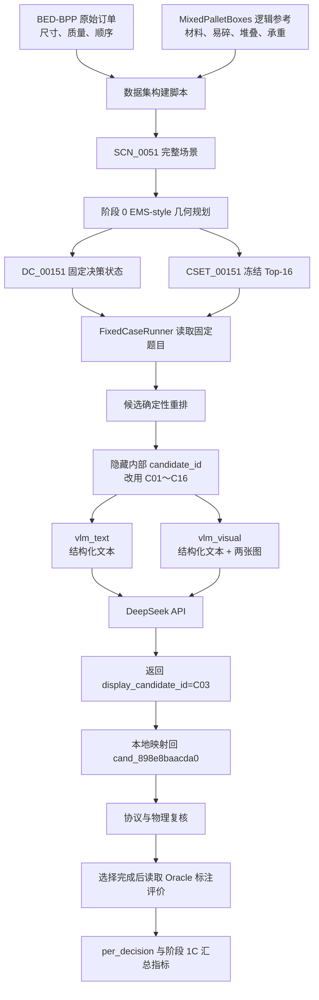
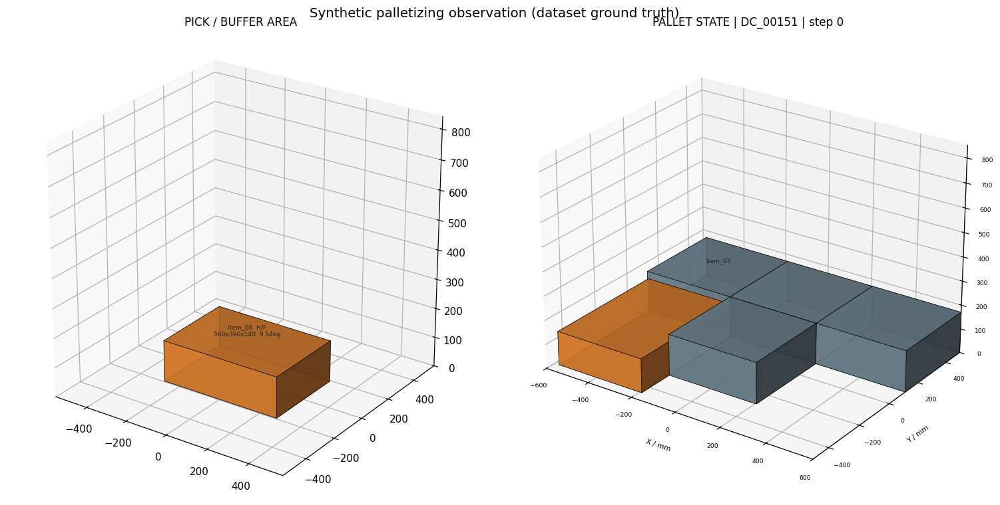
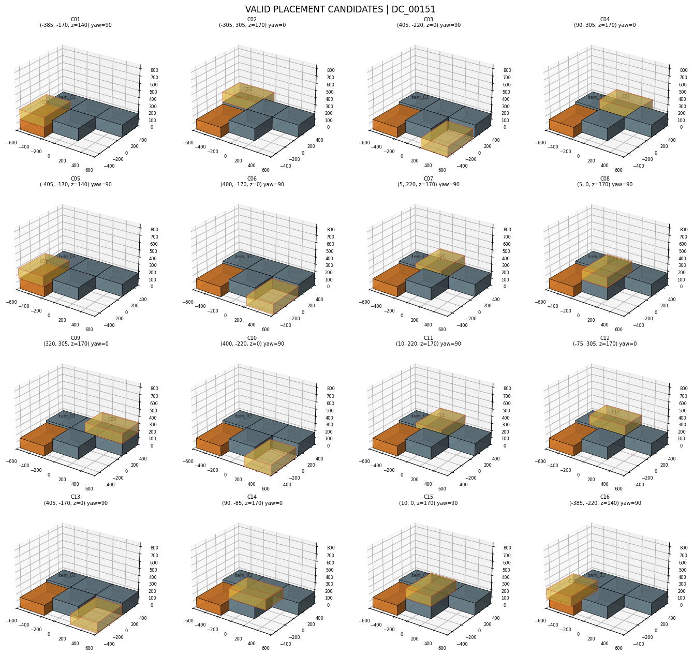

# DeepSeek Flash 冒烟测试完整数据链路

## 1. 文档目的

本文以本地实验目录 `semantic_pallet_planner/outputs/EXP_1C_DEEPSEEK_FLASH_SMOKE` 中的真实产物为例，解释阶段 1C 从数据集读取、几何候选生成、Top-K 冻结、VLM 图文输入构造、DeepSeek 调用、响应解析到隐藏标注评价的完整链路。

这个冒烟测试使用一个固定决策案例 `DC_00151`，分别运行：

- `vlm_text`：只发送结构化文本；
- `vlm_visual`：发送同一份结构化文本，再附加当前工作区图和候选拼图。

两种模式都调用 `deepseek-flash`，都选择显示候选 `C03`，都成功通过协议校验，没有格式修复和几何回退。该结果证明端到端工程链路已经打通，但一个案例不能证明模型的平均决策质量。事实上，本案例中 C03 的语义效用为 `0.60`，语义 Oracle 的效用为 `0.64`，说明模型仍有可测量的语义遗憾。

## 2. 一张图理解完整链路



系统的职责边界是：几何规划器负责产生合法动作，VLM 只从合法动作中选择，不能自行生成坐标。Oracle、数据划分和来源订单等隐藏信息只在选择完成后用于评价，不发送给模型。

## 3. 本次实验配置和规模

实验配置快照位于本地输出目录的 `config.snapshot.json`。关键参数为：

| 参数 | 本次取值 | 含义 |
|---|---|---|
| `provider` | `deepseek` | 使用 DeepSeek 适配器 |
| `model` | `deepseek-flash` | 支持本项目视觉输入的 DeepSeek 模型名 |
| `top_k` | 16 | 每个固定案例最多保留 16 个几何候选 |
| `topk_mode` | `diverse_v1` | 兼顾几何分数和候选分层多样性 |
| `temperature` | 0.0 | 降低随机性 |
| `thinking` | `disabled` | 关闭思考模式 |
| `max_output_tokens` | 512 | 最大输出 token 数 |
| `max_format_repairs` | 1 | JSON 格式错误时最多修复一次 |
| `fallback_policy` | `geometry_greedy` | VLM 最终失败时退回几何贪心 |
| `cache_mode` | `read_write` | 读取已有缓存，也保存新响应 |

本次 `metrics/per_decision.csv` 只有两行，即同一个 `DC_00151` 上的 `vlm_text` 和 `vlm_visual`。没有运行几何基线、规则基线和 Candidate Oracle，因此这次输出中的“VLM 对几何基线”配对比较样本数为 0。

## 4. 数据从哪里来

### 4.1 原始来源

数据集的来源清单见 [`semantic_pallet_dataset_v1/provenance/manifest.json`](../semantic_pallet_dataset_v1/provenance/manifest.json)：

- **BED-BPP**：提供订单、商品身份、箱体长宽高、质量和到货顺序；
- **MixedPalletBoxes**：提供材料、易碎、可堆叠和顶部承重等语义属性的生成逻辑参考。

语义属性是确定性合成属性，特别是 `top_load_limit_kg_synthetic`，不能解释成真实工业抗压实验数据。详细数据集设计可继续阅读 [`dataset_v1解析.md`](../semantic_pallet_dataset_v1/docs/dataset_v1解析.md)。

### 4.2 SCN_0051 对应的原始订单片段

`SCN_0051` 来自 BED-BPP：

- `source_order_key = 00105768`；
- `source_order_id = 00177774`；
- 使用该订单中顺序位置 6～15 的 10 个箱体；
- 场景属于 `validation`；
- 容器为 `1200 × 1000 × 850 mm`，最大载荷 `1000 kg`；
- 到货缓冲区大小为 1，因此每一步只决策当前箱体。

10 个箱体由以下四类原始商品组成：

| 到货位置 | BED-BPP 商品 ID | 原始尺寸/mm | 原始质量/kg | 场景物料 |
|---|---|---|---:|---|
| 6～9 | `00111039` | 395×390×170 | 7.42 | `item_01`～`item_04` |
| 10～11 | `00109198` | 560×390×140 | 9.54 | `item_05`～`item_06` |
| 12～13 | `00104442` | 590×380×230 | 6.36 | `item_07`～`item_08` |
| 14 | `00100456` | 580×390×260 | 9.387 | `item_09` |
| 15 | `00110043` | 590×260×290 | 5.35 | `item_10` |

完整场景存放于 [`SCN_0051.json`](../semantic_pallet_dataset_v1/tasks/scenarios/SCN_0051.json)。来源订单 ID 和原始商品 ID 属于审计信息，不会进入 VLM 请求。

## 5. 这次拿了哪些数据

### 5.1 固定决策案例 DC_00151

[`DC_00151.json`](../semantic_pallet_dataset_v1/tasks/decision_cases/DC_00151.json) 是从 `SCN_0051` 截取的第 5 步之后的固定状态：

- 已放置 `item_01`～`item_05`，共 5 个箱体；
- 当前待放置箱体是 `item_06`；
- `item_06` 尺寸为 `560×390×140 mm`，质量 `9.54 kg`；
- 它被标为 `heavy=true` 对应的重物类别，同时 `fragile=true`；
- 当前业务指令为“易碎箱应尽量不承载其他箱体，并优先放在较高层。”；
- 对应候选集合为 `CSET_00151`；
- 物理状态哈希为 `f4a41b...a6e0`。

这里的 `state_hash` 由容器、已放置物料、当前可用物料和缓冲区大小计算 SHA-256。模型返回时必须原样带回该哈希，防止把旧状态的答案用于新状态。

### 5.2 为什么看不到 item_07～item_10

`SCN_0051` 中还有未来到货的 `item_07`～`item_10`，但固定请求只包含当前 `available_items=[item_06]`。VLM 不知道后续物料，从而保持在线决策条件，避免未来信息泄漏。

## 6. 几何规划如何得到 Top-K

### 6.1 冒烟运行读取的是冻结候选

本次冒烟测试是固定 Decision Case 实验。运行时 [`FixedCaseRunner`](../semantic_pallet_planner/src/semantic_pallet_planner/runners/core.py) 直接读取已经构建好的 `CSET_00151`，不会在 API 调用前重新运行候选生成器，因此 `generation_time_s=0.0`。

Top-K 候选是在数据集构建阶段由 EMS-style 几何生成器产生并冻结的。固定候选的好处是：文本 VLM、视觉 VLM、几何基线和 Oracle 都面对完全相同的选项，差异只来自“选择”，不会混入候选重生成和轨迹分叉。

### 6.2 候选枚举

在线版本的对应实现位于 [`planner/generator.py`](../semantic_pallet_planner/src/semantic_pallet_planner/planner/generator.py) 和 [`planner/constraints.py`](../semantic_pallet_planner/src/semantic_pallet_planner/planner/constraints.py)。主要步骤是：

1. 读取当前唯一待放置箱体；
2. 分别尝试 `yaw=0°` 和 `yaw=90°`；
3. 从托盘边界、已放置箱体边缘和支撑层生成极值点/EMS-style 候选点；
4. 对每个 `(x,y,z,yaw)` 进行物理过滤；
5. 对合法候选计算四项几何分量；
6. 计算帕累托前沿；
7. 按 `diverse_v1` 的几何分数和分层多样性保留 Top-K。

### 6.3 物理过滤

候选需要依次满足：

- 不超出 `1200×1000×850 mm` 容器边界；
- 不与已有箱体发生三维重叠；
- 上层候选的支撑面积比例至少为 `0.70`；
- 候选质心投影位于某个有效支撑矩形内；
- 支撑物允许堆叠；
- 载荷向下传播后不超过任一支撑物的合成顶部承重；
- 总质量不超过容器最大载荷。

`DC_00151` 的审计结果为：

| 项目 | 数量 |
|---|---:|
| 原始位姿尝试 | 280 |
| 越界拒绝 | 179 |
| 重叠拒绝 | 48 |
| 支撑不足拒绝 | 34 |
| 物理合法候选 | 19 |
| 最终返回候选 | 16 |

三个拒绝类别合计 `179+48+34=261`，加上 19 个合法候选正好等于 280 次尝试。

### 6.4 几何评分和 Top-K 多样性

每个合法候选计算：

```text
geometry_score =
    0.35 × compactness
  + 0.25 × height
  + 0.25 × stability
  + 0.15 × balance
```

- `compactness`：码垛包围体越紧凑越高；
- `height`：最终最高顶面越低越高；
- `stability`：本实现取支撑面积比例；
- `balance`：整体质心越接近托盘中心越高。

`diverse_v1` 不会简单截取加权总分最高的 16 个。它先为不同分层保留代表候选，再用总分补足。分层综合考虑底层/上层、中心/边缘、支撑物数量、旋转角和是否位于帕累托前沿。这样可以避免 16 个候选全部聚集在几乎相同的位置。

本案例几何 Oracle 是 `cand_69012600096a`，几何分为 `0.8918448`。两个帕累托候选都保留在 Top-16 中，`pareto_recall_at_k=1.0`，且至少保留了一个 epsilon 最优候选。

## 7. 为什么还要重新编号候选

原始候选带有内部 ID 和固定排列顺序。如果把它们原样发送给模型，模型可能利用“第一个通常最好”等位置规律，也可能在提示词中看到内部标识。

[`candidate_mapping.py`](../semantic_pallet_planner/src/semantic_pallet_planner/vlm/candidate_mapping.py) 使用：

```text
SHA256(seed, request_id, mapping_version)
```

生成当前案例的局部随机种子，然后确定性打乱 16 个候选，并执行：

1. 删除候选中的真实 `candidate_id`；
2. 按打乱后的顺序赋予 `C01`～`C16`；
3. 只在本地 `mapping.audit.json` 保存显示编号到真实 ID 的映射；
4. 文本模式和视觉模式使用完全相同的映射。

本次映射如下：

| 显示编号 | 内部候选 | 位姿 `(x,y,z,yaw)` | 支撑率 | 几何分 | 语义效用 | 说明 |
|---|---|---|---:|---:|---:|---|
| C01 | `cand_48c6598b45c5` | (-385, -170, 140, 90) | 1.000000 | 0.721549 | 0.383421 |  |
| C02 | `cand_5195c780c057` | (-305, 305, 170, 0) | 1.000000 | 0.686641 | 0.640000 |  |
| C03 | `cand_898e8baacda0` | (405, -220, 0, 90) | 1.000000 | 0.878506 | 0.600000 | DeepSeek 选择 |
| C04 | `cand_9aa3dc3e1459` | (90, 305, 170, 0) | 1.000000 | 0.694157 | 0.640000 |  |
| C05 | `cand_c61ec9fe53e3` | (-405, -170, 140, 90) | 0.948718 | 0.705729 | 0.383421 |  |
| C06 | `cand_69012600096a` | (400, -170, 0, 90) | 1.000000 | 0.891845 | 0.600000 | 几何 Oracle |
| C07 | `cand_e0f3b0d69ff3` | (5, 220, 170, 90) | 1.000000 | 0.695841 | 0.640000 |  |
| C08 | `cand_01c6240dfd02` | (5, 0, 170, 90) | 1.000000 | 0.702876 | 0.640000 |  |
| C09 | `cand_7cb7bec8e43f` | (320, 305, 170, 0) | 1.000000 | 0.695841 | 0.640000 |  |
| C10 | `cand_f2506d713fbd` | (400, -220, 0, 90) | 1.000000 | 0.878535 | 0.600000 |  |
| C11 | `cand_bfd4c4d17d4b` | (10, 220, 170, 90) | 1.000000 | 0.695926 | 0.640000 |  |
| C12 | `cand_dc6dfb02f70e` | (-75, 305, 170, 0) | 1.000000 | 0.691605 | 0.640000 |  |
| C13 | `cand_fac6dda1bfa1` | (405, -170, 0, 90) | 1.000000 | 0.891820 | 0.600000 |  |
| C14 | `cand_1ba4f1932d27` | (90, -85, 170, 0) | 0.705357 | 0.633676 | 0.640000 |  |
| C15 | `cand_cbbc58ac911f` | (10, 0, 170, 90) | 1.000000 | 0.702989 | 0.640000 | 语义 Oracle |
| C16 | `cand_42c9de7d491e` | (-385, -220, 140, 90) | 0.910714 | 0.690677 | 0.383421 |  |

模型只能看到左侧的 `Cxx`、位姿和公开几何属性，看不到右侧内部 ID、语义效用、“Oracle”标签和原始候选排序。

## 8. 给 VLM 的文本数据是什么

[`prompt_builder.py`](../semantic_pallet_planner/src/semantic_pallet_planner/vlm/prompt_builder.py) 生成两个部分。

### 8.1 System Prompt

System Prompt 规定：

- 所有候选都已通过几何和物理合法性检查；
- 先满足自然语言业务规则，再考虑几何质量；
- 只能选择 C01～CK；
- 不能生成坐标、修改候选或推测未来物料；
- 只能输出一个满足固定字段约束的 JSON 对象。

### 8.2 DECISION_REQUEST

用户文本中包含：

- `request_id` 和 `state_hash`；
- 自然语言业务指令；
- 容器尺寸和坐标系；
- 5 个已放置箱体的公开属性和位姿；
- 当前 `item_06` 的公开属性；
- 16 个候选的显示编号、位姿、支撑、载荷余量、结果几何和四项几何分量；
- 视觉模式下两张图片的逻辑占位符。

不会包含：

- Oracle 候选；
- 候选语义分数；
- `ground_truth_rule` 结构化标签；
- 数据划分名称；
- 来源订单和来源商品 ID；
- 真实候选 ID；
- 后续物料；
- 选择后的评价结果。

发送前 [`leakage.py`](../semantic_pallet_planner/src/semantic_pallet_planner/vlm/leakage.py) 会检查禁止字段以及真实候选 ID 是否出现在序列化请求或提示词中。本次文本和视觉请求的泄漏报告都为 `passed=true`，命中数为 0。

## 9. 视觉模式额外整理了什么

视觉模式通过 [`prepare_visual_request()`](../semantic_pallet_planner/src/semantic_pallet_planner/visualization/renderer.py) 现场从选择前公开请求渲染两张图。

### 9.1 工作区图



左侧是当前取料/缓冲区中的 `item_06`，右侧是已放置 `item_01`～`item_05` 的托盘状态。颜色编码由公开物料属性决定。

图标题中显示的 `step 0` 是当前渲染辅助函数写入的占位值，实际 Decision Case 是 `step_index=5`。该标题不影响候选坐标、文本请求或评价，但后续应修改为真实步号或移除，避免人工阅读时误解。

### 9.2 候选拼图



拼图按 4×4 展示 C01～C16。每个子图都包含同一当前托盘状态，并用半透明黄色箱体显示该候选放置结果。标题只显示 C 编号和 `(x,y,z,yaw)`，不会显示真实候选 ID。

### 9.3 图片如何发送

[`deepseek_client.py`](../semantic_pallet_planner/src/semantic_pallet_planner/vlm/deepseek_client.py) 会：

1. 读取两张 PNG；
2. Base64 编码为 `data:image/png;base64,...`；
3. 在用户消息中先放文本块，再追加两个 `image_url` 块；
4. 设置图片细节为 `original`；
5. 请求 `response_format={"type":"json_object"}`。

因此本次 `vlm_visual` 确实向 DeepSeek 请求发送了两张图。证据包括：

- `prompt.json.image_paths` 中有两个绝对路径；
- `public_request.json.visual_inputs` 为 `attached_image_1/2`；
- 两张图片实际存在；
- 视觉输入 token 为 6072，高于文本模式的 4363。

最后一项只能说明供应商对视觉请求统计了更多输入 token；图片是否被模型有效利用，需要通过多案例配对结果判断，不能由 token 数单独证明。

## 10. DeepSeek API 请求和缓存逻辑

[`runners/stage1c.py`](../semantic_pallet_planner/src/semantic_pallet_planner/runners/stage1c.py) 根据配置创建一个共享 `DeepSeekClient`，并注册 `vlm_text` 和 `vlm_visual` 两个选择器。

一次请求的核心结构为：

```json
{
  "model": "deepseek-flash",
  "messages": [
    {"role": "system", "content": "系统约束"},
    {"role": "user", "content": ["文本块", "可选图片1", "可选图片2"]}
  ],
  "temperature": 0.0,
  "max_tokens": 512,
  "response_format": {"type": "json_object"},
  "thinking": {"type": "disabled"},
  "stream": false
}
```

API Key 只从 `DEEPSEEK_API_KEY` 环境变量读取，不写入配置快照、请求产物或响应产物。

缓存键由供应商、模型请求内容和提示词版本共同决定。第一次真实调用后，原始模型结果保存到实验目录的 `cache/`。相同输入再次运行时可能直接读取缓存，此时 `cache_hit=true`，不能把缓存时延解释成新的 API 时延。本次两次调用均为 `cache_hit=false`。

## 11. VLM 实际返回了什么

### 11.1 文本模式

模型返回的核心内容为：

```json
{
  "schema_version": "pallet_vlm_choice_v1",
  "request_id": "DC_00151",
  "state_hash": "f4a41b3542f424055e3bd499867ae2b963cafb8ae42cba325481d5073959a6e0",
  "display_candidate_id": "C03",
  "confidence": 0.85,
  "applied_rule": "易碎箱优先高层且不承载其他箱体",
  "reason": "C03将易碎箱置于底层空位，上方无其他箱体承载，且平衡与紧凑度评分最高，符合易碎箱优先高层（此处无更高层可放）且不承载的规则。"
}
```

耗时 `1.1701 s`，输入 4363 tokens，输出 142 tokens。

### 11.2 视觉模式

模型同样返回 C03：

```json
{
  "schema_version": "pallet_vlm_choice_v1",
  "request_id": "DC_00151",
  "state_hash": "f4a41b3542f424055e3bd499867ae2b963cafb8ae42cba325481d5073959a6e0",
  "display_candidate_id": "C03",
  "confidence": 0.86,
  "applied_rule": "易碎件优先高层且不承载其他箱体",
  "reason": "C03将易碎箱置于底层空位，上方无其他箱体承载，符合易碎件不承重且优先较高层的规则，同时几何平衡与紧凑度较好。"
}
```

耗时 `1.8714 s`，输入 6072 tokens，输出 135 tokens。

### 11.3 对返回理由的判断

两个回答都正确遵守了输出协议，但其语义解释并不完全正确：

- C03 的 `z_base_mm=0`，它是底层候选；
- C02、C04、C07～C09、C11、C12、C14、C15 等候选可放在 `z=170 mm`；
- 因此文本模式所称“此处无更高层可放”与候选列表不符；
- C03 的几何质量较高且不向已有箱体施加载荷，但它的紧凑度、平衡分和几何总分都不是 16 个候选中的最高值，因此“评分最高”也不准确。

这说明“JSON 合法”与“语义选择正确”是两个不同评价维度。协议成功率应达到工程门槛，语义质量则必须通过 Oracle 指标和多案例配对实验衡量。

## 12. 返回结果如何恢复为可执行动作

[`response_parser.py`](../semantic_pallet_planner/src/semantic_pallet_planner/vlm/response_parser.py) 按以下顺序处理响应：

1. 解析顶层 JSON；
2. 按 JSON Schema 检查字段类型、必填字段和额外字段；
3. 检查 `request_id` 是否仍为 `DC_00151`；
4. 检查 `state_hash` 是否匹配当前物理状态；
5. 检查 `C03` 是否属于合法显示编号；
6. 从本地映射恢复 `C03 → cand_898e8baacda0`；
7. 生成内部 `pallet_selector_response_v1`；
8. 再由 [`protocol.resolve_response()`](../semantic_pallet_planner/src/semantic_pallet_planner/protocol.py) 确认内部 ID 确实存在于当前候选集合。

如果第一次输出只是 JSON 格式或 Schema 错误，选择器最多请求一次格式修复。如果是未知候选、状态哈希错配、坐标注入、网络错误或修复后仍不合法，则抛出错误，由运行器根据 `fallback_policy` 决定是否采用 `geometry_greedy`。本次两个响应一次成功，因此：

- `attempt_count=1`；
- `repair_count=0`；
- `fallback=false`；
- `vlm_response_valid=true`。

## 13. 评测指标如何计算

### 13.1 隐藏语义评价

模型选择完成后，运行器才读取 [`DC_00151` 的 Oracle 标注](../semantic_pallet_dataset_v1/annotations/oracle_candidate_scores/DC_00151.json)。本案例规则类型为 `fragile_protect`，对每个易碎箱计算：

```text
fragile_score =
    0.6 × max(0, 1 - supported_load / top_load_limit)
  + 0.4 × min(1, z_base / max_height)
```

场景中 `item_05` 和当前 `item_06` 都是易碎箱，因此候选语义效用是两个易碎箱得分的平均值。

- C03 把 item_06 放在底层，两个易碎箱都不承载载荷，因此平均语义效用为 `0.60`；
- C15 把 item_06 放在 `z=170 mm`，同时不压在 item_05 上，平均语义效用为 `0.64`；
- C15 在语义效用最高的一组候选中拥有最好的几何分，因此被标为语义 Oracle。

### 13.2 单步核心指标

| 指标 | 本次文本/视觉结果 | 含义 |
|---|---:|---|
| `soft_utility` | 0.60 | 选择后的语义软效用 |
| `oracle_hit` | false | 是否精确选择语义 Oracle C15 |
| `oracle_regret` | 0.04 | `0.64 - 0.60` |
| `semantic_hard_violations` | 0 | 业务硬规则违规数；本规则是软规则 |
| `hard_violations` | 0 | 独立几何复核发现的违规数 |
| `geometry_score` | 0.87850585 | C03 的几何加权分 |
| `max_height_mm` | 170 | 执行动作后的最高顶面 |
| `center_of_mass_offset_mm` | 50.714 | 整体质心离托盘中心的水平距离 |
| `minimum_support_ratio` | 1.0 | 已放箱体中的最低支撑比例 |
| `volume_utilization` | 0.162653 | 箱体总体积/容器体积 |
| `placed_count` | 6 | 执行候选后的已放箱体数 |
| `total_mass_kg` | 48.76 | 执行候选后的总质量 |

### 13.3 协议、性能和审计指标

| 指标 | 文本 | 视觉 |
|---|---:|---:|
| 合法响应数/样本数 | 1/1 | 1/1 |
| VLM 合法率 | 100% | 100% |
| 回退次数 | 0 | 0 |
| 修复次数 | 0 | 0 |
| API 时延 | 1.1701 s | 1.8714 s |
| 输入 tokens | 4363 | 6072 |
| 输出 tokens | 142 | 135 |
| 缓存命中 | 否 | 否 |
| 泄漏命中 | 0 | 0 |
| 选择位置 | C03 | C03 |

配置中没有填写 DeepSeek 输入、输出单价，因此 `estimated_cost=null`。汇总文件中总成本显示为 `0.0` 只是当前聚合实现对空价格的数值占位，不能解释为 API 免费。

### 13.4 文本与视觉配对比较

文本和视觉都选择 C03，所以：

- `vlm_visual_minus_vlm_text.n=1`；
- 平均语义效用差为 0；
- 1 次平局；
- 当前案例没有观察到视觉增益。

样本量只有 1，无法推断视觉输入总体无效。必须在 validation 的 30 个固定 Decision Case 上做配对比较。

## 14. 如何阅读本次 outputs

| 文件 | 作用 | 阅读重点 |
|---|---|---|
| `config.snapshot.json` | 实验配置快照 | 模型、Top-K、缓存、温度、回退策略 |
| `selector_inputs/vlm_*/DC_00151/public_request.json` | VLM 可见请求 | 不含内部候选 ID 和隐藏答案 |
| `mapping.audit.json` | 本地显示编号映射 | C03 如何恢复为内部 ID |
| `prompt.json` | 实际系统提示词、用户文本和图片路径 | 文本/视觉输入差异 |
| `workspace.png` | 当前箱体和当前托盘状态 | 选择前观察 |
| `candidates_montage.png` | C01～C16 的可行放置图 | 视觉候选集合 |
| `leakage_report.json` | 单请求泄漏扫描 | `passed` 和各类命中 |
| `response.json` | 原始响应、解析结果和内部响应 | 模型到底返回了什么 |
| `cache/*.json` | 内容寻址响应缓存 | 是否可复用同一 API 结果 |
| `steps.jsonl` | 完整事件证据 | 请求、候选、前后状态、响应和指标 |
| `metrics/per_decision.csv` | 每个方法每个案例一行 | 论文统计的基础表 |
| `metrics/protocol_summary.json` | 协议合法率与回退 | 工程稳定性 |
| `metrics/cost_summary.json` | tokens、时延、成本、缓存 | 运行开销 |
| `metrics/position_bias.json` | 显示编号选择频数 | 检查 C01/C02 等位置偏好 |
| `metrics/paired_comparisons.json` | 同案例方法配对差 | 文本、视觉及基线比较 |
| `metrics/summary.json` | 分组描述统计和 bootstrap 区间 | 正式实验汇总 |
| 根目录 `leakage_report.json` | 所有 VLM 请求的泄漏汇总 | 本次 2 份报告均通过 |

`summary.json` 中本案例的置信区间上下界与单个观测值相同，这是 `n=1` 的自然结果，不代表估计很精确。

## 15. 冒烟测试和 validation 的关系

你的理解大体正确：validation 会复用同一条链路处理更多固定案例。但它不是把同一个案例机械重复 30 次，而是处理 validation 中 **10 个不同场景各 3 个决策点，共 30 个不同 Decision Case**。

若运行默认六种方法：

| 实验层级 | Decision Case | 方法数 | 指标行数 | 正常情况下 VLM 调用数 |
|---|---:|---:|---:|---:|
| 当前冒烟 | 1 | 2 | 2 | 2 |
| validation 默认矩阵 | 30 | 6 | 180 | 60 |
| 全数据阶段 1C 验收 | 360 | 6 | 2160 | 720 |

六种方法是：`random_valid`、`geometry_greedy`、`handcrafted_rule`、`vlm_text`、`vlm_visual`、`candidate_oracle`。只有两个 VLM 方法调用远程模型，其余四个是本地基线。

validation 的主要作用是：

1. 统计协议合法率、修复率和回退率；
2. 比较 VLM 与几何/规则基线的配对语义效用；
3. 比较视觉模式和文本模式；
4. 检查选择位置分布是否偏向某个 C 编号；
5. 统计 tokens、时延和成本；
6. 在进入测试划分前发现提示词、模型和工程实现问题。

当前冒烟实验只运行两个 VLM 方法，所以无法产生 VLM 对几何基线的配对结果。validation 建议保留默认六方法矩阵。

## 16. 代码调用顺序

从命令行进入后的执行顺序如下：

1. [`cli.py`](../semantic_pallet_planner/src/semantic_pallet_planner/cli.py) 读取 YAML，检查 API Key，创建数据仓库和实验目录；
2. [`runners/stage1c.py`](../semantic_pallet_planner/src/semantic_pallet_planner/runners/stage1c.py) 创建 DeepSeek 客户端、缓存，并注册文本/视觉选择器；
3. [`repository.py`](../semantic_pallet_planner/src/semantic_pallet_planner/repository.py) 按 Schema 读取并交叉校验 Scenario、Decision Case 和 Candidate Set；
4. [`runners/core.py`](../semantic_pallet_planner/src/semantic_pallet_planner/runners/core.py) 构造固定案例请求并逐方法运行；
5. [`candidate_mapping.py`](../semantic_pallet_planner/src/semantic_pallet_planner/vlm/candidate_mapping.py) 打乱候选、隐藏真实 ID、生成 C 编号；
6. 视觉模式调用 [`renderer.py`](../semantic_pallet_planner/src/semantic_pallet_planner/visualization/renderer.py) 和 [`primitives.py`](../semantic_pallet_planner/src/semantic_pallet_planner/visualization/primitives.py) 生成两张图；
7. [`prompt_builder.py`](../semantic_pallet_planner/src/semantic_pallet_planner/vlm/prompt_builder.py) 生成固定版本提示词和输出 Schema；
8. [`leakage.py`](../semantic_pallet_planner/src/semantic_pallet_planner/vlm/leakage.py) 执行发送前泄漏扫描；
9. [`deepseek_client.py`](../semantic_pallet_planner/src/semantic_pallet_planner/vlm/deepseek_client.py) 发送 OpenAI 兼容 HTTP 请求；
10. [`response_parser.py`](../semantic_pallet_planner/src/semantic_pallet_planner/vlm/response_parser.py) 校验 JSON 并恢复内部候选 ID；
11. [`protocol.py`](../semantic_pallet_planner/src/semantic_pallet_planner/protocol.py) 再次校验状态和候选归属；
12. [`evaluation/metrics.py`](../semantic_pallet_planner/src/semantic_pallet_planner/evaluation/metrics.py) 在选择完成后使用隐藏 Oracle 计算单案例指标；
13. [`evaluation/stage1c.py`](../semantic_pallet_planner/src/semantic_pallet_planner/evaluation/stage1c.py) 汇总协议、成本、位置和配对比较；
14. [`logging/artifacts.py`](../semantic_pallet_planner/src/semantic_pallet_planner/logging/artifacts.py) 保存逐步证据、CSV、汇总和可复现性清单。

## 17. 本案例能得出什么结论

可以确认：

- DeepSeek Flash 文本请求可以正常完成；
- 两张 PNG 确实进入视觉 API 请求；
- 文本和视觉响应都满足严格 JSON 协议；
- 显示编号能正确映射回内部候选；
- 没有真实候选 ID 或隐藏标注泄漏；
- 没有格式修复、回退或物理违规；
- tokens、时延、响应内容和评价指标均被保存。

还不能确认：

- DeepSeek Flash 的平均语义效用高于几何基线；
- 视觉模式总体优于文本模式；
- 98% 协议合法率门槛已经达到；
- 模型不存在位置偏差；
- 延迟、token 和成本在 30 个 validation 案例上仍稳定。

本案例还指出两个后续关注点：

1. 模型虽然协议正确，却错误声称“无更高层可放”，说明需要依靠多案例语义指标，而不能只人工查看 JSON 是否漂亮；
2. 工作区图标题暂时显示 `step 0`，实际为第 5 步，后续应修正该可视化元数据。

当前泄漏扫描也有明确边界：它能扫描 JSON 键、提示词文本和真实候选 ID，但 `future_item_hits` 目前只是空列表占位，也不会分析图片像素。未来物料隔离主要依靠公开请求只包含当前缓冲区物料，以及图片只从该公开请求渲染。正式验收前应继续保留输入产物抽查。

因此，这个冒烟测试适合用作阶段 1C 的端到端讲解案例；下一步 validation 则负责把同一数据链路扩展到 30 个不同案例，形成可以比较和统计的实验结论。
