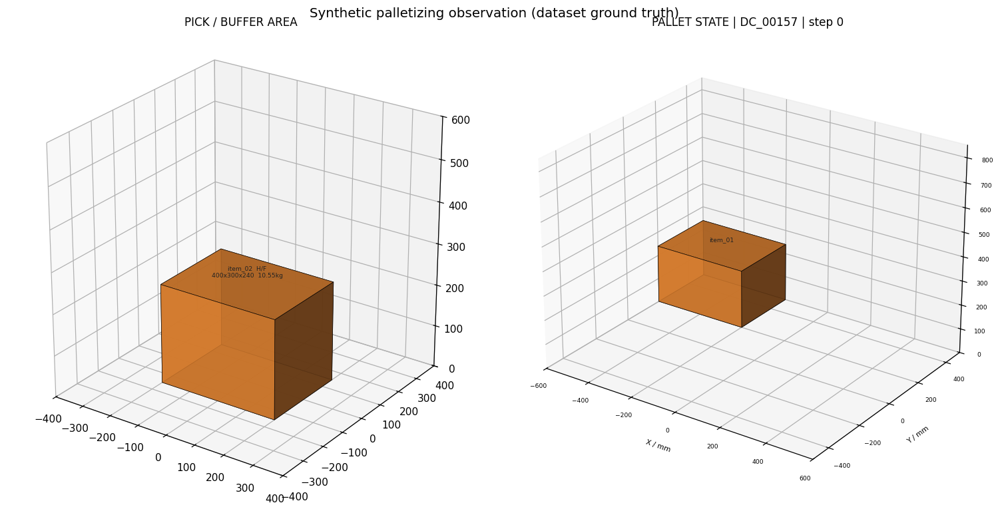
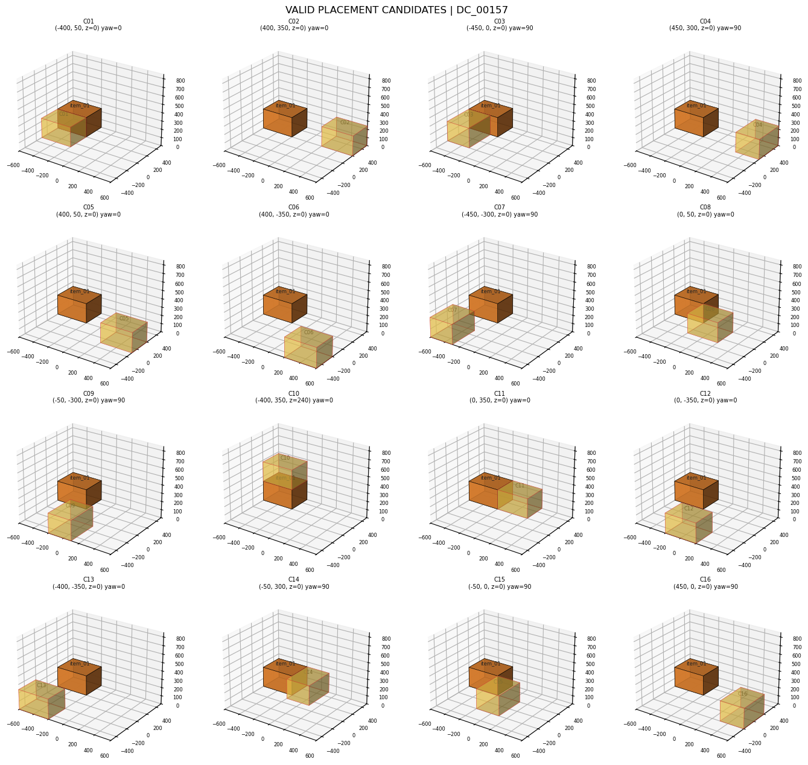

# DeepSeek Flash 阶段 1C 验证集实验产物解析

> 对应本地实验：`semantic_pallet_planner/outputs/EXP_1C_DEEPSEEK_FLASH_VALIDATION`。本文基于该目录的实际文件、源代码和用户提供的 DeepSeek 控制台截图编写。当前 Git 规则允许提交这轮验证实验的原始产物，其他历史 `outputs/` 仍被忽略；文中的代表案例图片已复制到 `docs/assets/deepseek_flash_validation/`。

## 1. 先看结论

这次实验**完成了 validation 阶段的固定案例矩阵**：10 个验证场景，每个场景 3 个 Decision Case，合计 30 个不同决策点；每个决策点运行 6 种方法，共 180 条决策记录。其中 DeepSeek Flash 文本/视觉各运行 30 次，总计 60 次 API 请求。两个 VLM 方法均 30/30 返回有效协议响应；无格式修复、回退、本地响应缓存命中或记录到的模型输入泄漏。独立回放复核了 180 个事件，物理违规数为 0。

然而，这只是**验证集阶段性完成**，不是阶段 1C 的正式全量验收。实验方案中的正式矩阵要求 360 个 Decision Case × 6 方法 = 2160 行，覆盖更多划分；本目录只有 validation 的 30 × 6 = 180 行，没有正式 `acceptance_report.json`。模型效果也尚未显示优势：

- `vlm_text` 和 `vlm_visual` 在 30/30 个案例中选择了**同一个内部候选**，平均语义效用均为 `0.673572`；本轮没有观察到视觉增益。
- 几何贪心平均语义效用为 `0.681598`；VLM 减几何贪心的配对平均差为 `-0.008026`，6 胜、17 平、7 负。差值很小，不宜据此声称模型显著较差，但也不能声称优于几何基线。
- 使用隐藏业务规则的 `handcrafted_rule` 和使用答案的 `candidate_oracle` 均达到 `0.763555`。它们属于特权对照，不能与无特权的 VLM 按同等信息条件解释。
- 18 个被标为需要语义决策的案例中，VLM 精确命中 Oracle 仅 `2/18`；全文 30 个案例的精确命中为 `7/30`。这与“合法 JSON 30/30”是不同指标。

下面按“如何找到文件 → 如何还原一条决策 → 如何读汇总 → 如何判断是否满足要求”的顺序解释。

## 2. 实验入口、配置与数据范围

配置快照为本地 `config.snapshot.json`：`provider=deepseek`、`model=deepseek-flash`、`top_k=16`、`topk_mode=diverse_v1`、`temperature=0`、`thinking=disabled`、`max_output_tokens=512`、`max_format_repairs=1`、`fallback_policy=geometry_greedy`。API Key 从运行环境变量 `DEEPSEEK_API_KEY` 读取，配置快照不含密钥。对应可复用配置在 [`stage1c_deepseek_flash.yaml`](../semantic_pallet_planner/configs/stage1c_deepseek_flash.yaml)。

在 [`cli.py`](../semantic_pallet_planner/src/semantic_pallet_planner/cli.py) 中，`run-stage1c` 对 `--split validation` 调用 `repo.list_cases('validation')`，默认方法为：

| 方法 | 输入权限 | 在本次实验中的作用 |
|---|---|---|
| `random_valid` | 公开请求 | 随机合法候选基线 |
| `geometry_greedy` | 公开请求 | 几何分数最高的候选基线 |
| `handcrafted_rule` | 特权规则 | 显式读入隐藏业务规则的程序基线 |
| `vlm_text` | 公开文本 | DeepSeek Flash 纯文本选择 |
| `vlm_visual` | 公开文本＋两张图 | DeepSeek Flash 视觉选择 |
| `candidate_oracle` | 隐藏 Oracle | 固定候选集合内的答案上界 |

验证集文件 [`validation.json`](../semantic_pallet_dataset_v1/splits/validation.json) 包含 10 个场景、30 个固定决策案例。此次实验的实际记录覆盖全部 30 个案例、六种方法各 30 行。`metrics/per_episode.csv` 只有表头，因为本轮是**固定单步决策实验**，没有执行从第一箱到最后一箱的在线 episode。

## 3. 数据链路：原始订单到 30 道固定决策题

数据集源头、可见性约束和一个单案例的完整解释见 [`DeepSeek-Flash冒烟测试完整数据链路.md`](DeepSeek-Flash冒烟测试完整数据链路.md)。本次 validation 只是将同一链路应用到 30 个不同的 Decision Case，并加上四种本地基线。

```text
BED-BPP 的箱体尺寸、质量、到货顺序
       + MixedPalletBoxes 风格的确定性合成属性
       ↓ 数据集构建
validation 的 10 个 Scenario（SCN_0051～SCN_0060）
       ↓ 每场截取 3 个固定状态
30 个 Decision Case（DC_00151～DC_00180）
       ↓ 读取已冻结的几何候选集合
每个案例的 Top-K 合法候选（最多 16 个）
       ↓ 六方法同题选择
180 条固定决策记录，其中 60 条由 VLM 产生
       ↓ 选择完成后读取隐藏 Oracle，统一评价
逐决策 CSV、按方法汇总、配对比较和审计报告
```

本次固定案例运行并不在调用 DeepSeek 时重新生成候选。候选来自数据集的 `candidates/candidate_sets/CSET_xxxxx.json`；`FixedCaseRunner` 使用 [`repository.py`](../semantic_pallet_planner/src/semantic_pallet_planner/repository.py) 读取并检验 Scenario、Decision Case、Candidate Set 的关联及 `state_hash`。因此 `generation_time_s=0` 只表示**本次运行没有重生成**，不表示几何规划本身耗时为零。

几何生成器的在线对应实现位于 [`planner/generator.py`](../semantic_pallet_planner/src/semantic_pallet_planner/planner/generator.py) 与 [`planner/constraints.py`](../semantic_pallet_planner/src/semantic_pallet_planner/planner/constraints.py)：按 0°/90° 朝向枚举极值点/支撑层位置，过滤越界、碰撞、支撑不足、重心不在支撑面、超载等非法动作，对合法候选计算紧凑度、高度、稳定性、平衡性，再按 `diverse_v1` 保留 Top-16。VLM 只做 Top-K 中的**离散选择**，不生成新坐标。

## 4. 一条 VLM 决策是怎样形成的

以 IDE 当前打开的 `DC_00157` 视觉响应为例。文件位于本地：

```text
selector_inputs/vlm_visual/DC_00157/
├── public_request.json        模型可见的结构化请求
├── mapping.audit.json         本地 C 编号→真实候选 ID 映射
├── workspace.png              当前取料箱和码垛状态
├── candidates_montage.png     C01～C16 逐候选放置图
├── prompt.json                最终系统提示词、用户文本、图片路径
├── leakage_report.json        发送前输入扫描
└── response.json              原始模型输出、解析输出、内部输出
```

### 4.1 文本模式与视觉模式共享同一道题

[`FixedCaseRunner`](../semantic_pallet_planner/src/semantic_pallet_planner/runners/core.py) 先取得同一份固定候选。随后 [`candidate_mapping.py`](../semantic_pallet_planner/src/semantic_pallet_planner/vlm/candidate_mapping.py) 用 `seed + request_id + mapping_version` 确定性打乱候选，将真实 `candidate_id` 从模型可见候选中移除，赋予 `C01`～`C16`。同一案例的文本和视觉模式使用完全相同的 `mapping_sha256`；我核对了本轮全部 30 对映射，全部一致。

模型看到的 `public_request.json` 包括业务指令、容器、已放置箱体、当前待放箱体、16 个候选的位置/支撑/载荷余量/几何分量。它不包含未来箱体、结构化隐藏规则、Oracle 答案、原始来源订单或真实候选 ID。

### 4.2 视觉模式确实发送图片

[`renderer.prepare_visual_request()`](../semantic_pallet_planner/src/semantic_pallet_planner/visualization/renderer.py) 从选择前的公开请求渲染 `workspace.png` 和 `candidates_montage.png`。[`DeepSeekClient.complete()`](../semantic_pallet_planner/src/semantic_pallet_planner/vlm/deepseek_client.py) 将两张 PNG 读入并编码为 `data:image/png;base64,...`，作为两个 `image_url` 消息块发送给 DeepSeek。全轮检查结果是：30 份视觉 `prompt.json` 各有 2 个图片路径，30 份文本 `prompt.json` 各有 0 个；目录中有 60 张对应 PNG。





工作区图标题显示 `step 0`，实际 `DC_00157` 的数据集步号并非 0；这是 [`prepare_visual_request()`](../semantic_pallet_planner/src/semantic_pallet_planner/visualization/renderer.py) 当前使用的占位元数据，后续应修正。图的箱体位置和候选编号仍来自当前公开请求。

### 4.3 模型响应如何变为内部动作

`DC_00157` 的 `response.json` 中，DeepSeek 输出 `display_candidate_id="C10"`、`confidence=0.82`，并称 C10 是较高层候选。程序经 [`response_parser.py`](../semantic_pallet_planner/src/semantic_pallet_planner/vlm/response_parser.py) 解析 JSON、检查 Schema、`request_id`、`state_hash` 和合法 C 编号，再通过本地映射恢复为 `cand_f5928c6714f1`。[`protocol.resolve_response()`](../semantic_pallet_planner/src/semantic_pallet_planner/protocol.py) 再次确认该内部 ID 属于当前候选集。随后运行器才读取隐藏 Oracle 计算语义结果。

`response.json` 的三个层次要分开读：

| 字段 | 内容 | 用途 |
|---|---|---|
| `attempts[].raw_text` | 供应商原始文字、token、时延、供应商请求 ID | 核对模型究竟回答了什么 |
| `parsed` | 通过严格 JSON 解析的 C 编号、理由、置信度 | 检查协议和文本解释 |
| `core_response` | 恢复出的内部 `candidate_id` | 交给已有码垛运行器执行或评价 |

若第一次输出格式错误，选择器至多修复一次；若最终失败且配置为 `geometry_greedy`，运行器记录错误并回退到本地几何选择。本轮 60 条响应的 `attempts` 长度均为 1，未发生修复或回退。

## 5. 按顺序阅读 outputs

| 本地文件 | 看什么 | 这次读出的事实 |
|---|---|---|
| `config.snapshot.json` | 冻结配置 | DeepSeek Flash、Top-16、温度 0、回退策略 |
| `manifest.json` | 配置/数据/代码/结果哈希、环境 | 实验追溯的入口 |
| `steps.jsonl` | 每次选择的完整事件 | 180 行；含 `before`、`request`、`candidate_set`、`response`、`after`、`metrics` |
| `selector_inputs/vlm_*/*/public_request.json` | 模型可见题目 | 共 60 份；候选均为 C 编号 |
| `mapping.audit.json` | C 编号映射和映射哈希 | 文本/视觉同案例一致；不要发送给模型 |
| `prompt.json` | 实际文字和图片路径 | 视觉 2 图，文本 0 图 |
| `response.json` | 原始回答、解析和内部恢复 | 可逐题审阅模型理由 |
| 各案例 `leakage_report.json` | 输入扫描 | 本轮 60 份都通过 |
| `cache/*.json` | 内容寻址的完整模型响应缓存 | 60 个缓存条目；本轮调用都未命中本地缓存 |
| `metrics/per_decision.csv` | 最重要的逐案例指标表 | 180 个数据行，同一 `decision_case_id` 可横向比较六方法 |
| `metrics/summary.json` | 方法分组均值、分位数及区间 | 每组 30 个案例、10 个场景聚类 |
| `metrics/protocol_summary.json` | VLM 协议合法率、回退、修复 | 两个 VLM 方法均 30/30 有效 |
| `metrics/paired_comparisons.json` | 同一案例上的效用差 | 文本/视觉与几何基线的配对结果 |
| `metrics/position_bias.json` | C 编号被选次数 | 初步位置分布；单轮不足以排除位置偏差 |
| `metrics/cost_summary.json` | token、时延、本地缓存和估算费用 | 价格未配置，费用字段不能代表真实支出 |
| `leakage_report.json` | 60 份泄漏报告汇总 | `passed=true`，命中 0 |
| `replay_report.json`、`validation_report.json` | 独立回放/校验 | 本次复核后都为 PASS，180 事件、物理违规 0 |

阅读 `per_decision.csv` 时，先按 `decision_case_id` 过滤，再看六方法的 `candidate_id`、`soft_utility`、`oracle_regret`、`geometry_score`、`hard_violations`。`oracle_hit` 是是否**精确选中一个指定的 Oracle ID**，与效用是否达到最优并非完全同义：多个候选可能效用相同。对 VLM 再查 `selected_display_position`、`vlm_response_valid`、`fallback`、`input_tokens`、`api_latency_s`，最后打开对应 `response.json` 阅读理由。

在项目根目录可直接运行下面的只读命令，先把一个案例的六行关键指标排在一起：

```bash
python - <<'PY'
import csv
from pathlib import Path
path = Path('semantic_pallet_planner/outputs/EXP_1C_DEEPSEEK_FLASH_VALIDATION/metrics/per_decision.csv')
for row in csv.DictReader(path.open()):
    if row['decision_case_id'] == 'DC_00157':
        print(row['method'], row['candidate_id'], row['soft_utility'],
              row['oracle_regret'], row['semantic_hard_violations'])
PY
```

再用以下命令不调用模型、只依据保存的事件和数据集做回放复核：

```bash
python -m semantic_pallet_planner.cli replay \
  --experiment semantic_pallet_planner/outputs/EXP_1C_DEEPSEEK_FLASH_VALIDATION
```

## 6. 核心指标与结果

### 6.1 六方法总览

| 方法 | 案例数 | 平均语义效用 ↑ | 平均 Oracle regret ↓ | 精确 Oracle 命中 | 平均几何分 ↑ | 物理违规 | 语义硬违规 |
|---|---:|---:|---:|---:|---:|---:|---:|
| `random_valid` | 30 | 0.662340 | 0.101215 | 2/30 | 0.686418 | 0 | 2 |
| `geometry_greedy` | 30 | 0.681598 | 0.081956 | 12/30 | 0.754286 | 0 | 1 |
| `handcrafted_rule` | 30 | **0.763555** | **0** | 30/30 | 0.706150 | 0 | 0 |
| `vlm_text` | 30 | 0.673572 | 0.089982 | 7/30 | 0.698062 | 0 | 1 |
| `vlm_visual` | 30 | 0.673572 | 0.089982 | 7/30 | 0.698062 | 0 | 1 |
| `candidate_oracle` | 30 | **0.763555** | **0** | 30/30 | 0.706150 | 0 | 0 |

`soft_utility` 和 Oracle regret 来自选择完成后读取的隐藏标注，不在 VLM 输入里。Oracle regret = 当前案例 Oracle 效用 − 当前方法效用；越小越好。`hard_violations` 是独立物理检查的违规数；`semantic_hard_violations` 是业务规则硬违规数，两者不能混为一谈。这次所有候选在物理上合法，但 `DC_00177` 的 VLM、几何贪心和随机方法有 1 次业务硬违规。

`handcrafted_rule` 本轮与 Candidate Oracle 全部同选，说明显式规则程序是强基线；它拥有 VLM 看不到的结构化规则信息，因此同时也定义了信息优势，不宜写成“VLM 在同等输入下输给它”。

### 6.2 配对比较

配对比较以同一个 Decision Case 为单位，从而避免不同题目难度混入差值：

| 比较 | 配对数 | 平均语义效用差 | 胜/平/负 |
|---|---:|---:|---:|
| 文本 VLM − 几何贪心 | 30 | `-0.008026` | 6 / 17 / 7 |
| 视觉 VLM − 几何贪心 | 30 | `-0.008026` | 6 / 17 / 7 |
| 视觉 VLM − 文本 VLM | 30 | `0` | 0 / 30 / 0 |

作为辅助稳健性检查，我另按 10 个场景先求场景内平均差，再用固定随机种子进行 10,000 次场景重抽样；“文本 VLM − 几何贪心”的配对均值约为 `-0.0080`，95% 自助法区间约为 `[-0.0301, 0.0123]`。该区间是**本文补算**，并非原 `paired_comparisons.json` 自带的字段。它跨过 0，因此此轮不支持“VLM 明显优于/劣于几何贪心”的统计断言。

`metrics/summary.json` 中每个方法的 95% 区间是对该方法自身均值的场景聚类区间，**不能直接通过两个方法区间是否重叠来判断配对差的显著性**。

### 6.3 按业务规则分组

validation 中五类规则各有 6 个固定案例。下表是按该案例所属规则分组的平均语义效用：

| 规则 | 几何贪心 | 文本/视觉 VLM | 规则程序/Oracle | 当前判断 |
|---|---:|---:|---:|---|
| `category_group` 同类靠近 | 0.661580 | 0.672968 | 0.765329 | VLM 略高于几何，但离 Oracle 仍远 |
| `category_separate` 类别分离 | 0.944445 | 0.944445 | 1.000000 | 两方法均有硬违规案例 |
| `fragile_protect` 保护易碎品 | 0.490636 | 0.499870 | 0.570212 | VLM 略高，仍会忽视下方易碎箱承重 |
| `heavy_center` 重物靠中心 | 0.509348 | 0.448597 | 0.680250 | 本轮 VLM 相对几何最明显的弱项 |
| `heavy_low` 重物靠下 | 0.801982 | 0.801982 | 0.801982 | 效用相同，不能据此推断精确 Oracle ID 相同 |

每组只有 6 题，适合作为错误类型线索，不能当作稳定的总体估计。

### 6.4 视觉与文本的实际关系

本轮 `vlm_text` 与 `vlm_visual` 的 30 个**真实候选 ID 全部一致**，所有配对语义结果平局；但 30 对 `reason` 文本都不完全相同。因而可以确定两种输入产生了相同的离散决策，不能推断视觉 API 没收到图。真实调用路径中，视觉请求确实包含两张图片；当前结果只能说明这些图片**没有带来可观测的选项变化或效用增益**。

视觉输入平均比文本多约 `1,640` 个输入 token/案例；平均 API 时延由 `1.177 s` 增至 `1.716 s`。包括图片生成在内的本地选择阶段平均耗时由 `1.182 s` 增至 `2.791 s`。后续是否保留视觉模式应由新增、预先定义的视觉相关任务和多案例消融决定，而不是仅凭“已传图”认定其有用。

## 7. 两个值得人工复盘的失败案例

### 7.1 DC_00157：放到高层不等于保护易碎品

指令是“易碎箱应尽量不承载其他箱体，并优先放在较高层”。文本和视觉模型都选择 C10：候选位姿 `(-400, 350, z=240 mm)`，支撑箱为 `item_01`。模型理由说它“符合优先放较高层且不承载其他箱体”。其余 15 个候选确实都位于底层，因此这句话描述了一个真实的高度区别；问题在于**上层放置会给下方的易碎箱增加载荷**，模型只看了当前箱体自己不会被压，却没有计入已放置易碎箱的受压风险。

本案例：

| 选择 | 候选 | 高度 | 语义效用 | 几何分 |
|---|---|---:|---:|---:|
| VLM | C10 | 240 mm | 0.436679 | 0.756745 |
| 几何贪心 | 底层候选 | 0 mm | 0.600000 | 高于 C10 |
| 语义 Oracle | C11 | 0 mm | 0.600000 | 0.851992 |

因此 VLM 相对几何贪心在这一题损失 `0.163321`，虽无物理违规，却产生明显语义遗憾。改进时应让模型明确考虑**放置动作对所有已放易碎箱的载荷影响**，而不只判断当前箱体的高度；也可在公开候选摘要中提供由非特权几何逻辑计算的载荷增量，避免让 VLM 从图片猜测。

特别要注意，当前公开候选的 `load.downward_load_kg` 在这个上层候选中仍为 `0.0`，不能把它直接读成“下方支撑箱没有增加载荷”；`minimum_remaining_capacity_kg=3.85` 才提示支撑箱承重余量发生变化。这个字段语义应在后续版本中澄清，必要时增加“各支撑箱新增载荷”这一由几何计算得到的可见量。

### 7.2 DC_00178：整体质心偏移不等于重物位置

指令是“重物应尽量靠近托盘底面中心”。模型选择 C08，理由称它的“质心偏移最小（87.7 mm）”。公开候选里的 `resulting_geometry.center_of_mass_offset_mm=87.711` 确实是**整垛结果的整体质心偏移**，但本条业务规则评价的是**重物自身相对托盘中心的位置**。C08 位姿是 `(405, -365, z=0 mm)`，远离中心；语义 Oracle C01 在 `(-85, 135, z=0 mm)`，更贴近中心。

| 候选 | 当前箱体中心位置/mm | 整体质心偏移/mm | 语义效用 |
|---|---|---:|---:|
| C08：VLM 选择 | `(405, -365)` | 87.711 | 0.301935 |
| C01：语义 Oracle | `(-85, 135)` | 见公开候选 | 0.795742 |

这是典型的**代理指标错用**：模型把优化整体平衡的几何指标，误当成“重物靠中心”的业务目标。VLM 相对几何贪心损失 `0.122540`，相对语义 Oracle 损失 `0.493807`，是本轮最大的 Oracle regret。后续提示词需要区分 `candidate.pose.(x,y)` 与 `resulting_geometry.center_of_mass_offset_mm` 的含义，或直接给出“当前重物到中心的距离”这一可计算、非隐藏的候选特征。

### 7.3 DC_00177：业务硬规则仍可能被合法候选违反

该案例规则为 `category_separate`，意在避免电子商品与重物接触。VLM 所选候选物理合法，但隐藏评价记录 `semantic_hard_violations=1`、`soft_utility=0.666667`；Oracle C02 的效用为 `1.0`、语义硬违规 0。说明“所有候选通过物理检查”只能保证不碰撞、支撑和载荷等几何物理条件，不能自动保证业务接触禁忌。后续应针对接触关系提供明确公开几何摘要，或加入确定性的业务约束后置校验。

## 8. 协议、位置与泄漏审计

### 8.1 协议健康度

`metrics/protocol_summary.json` 显示文本/视觉均 `n=30`、`valid_count=30`、`vlm_valid_rate=1.0`、`fallback_count=0`、`repair_count=0`，错误类别为空。它超过方案中“最终合法响应率至少 98%”的 validation 样本门槛，但该门槛的**正式全量验收**仍需要按计划在完整矩阵中检查。

### 8.2 显示位置分布

`metrics/position_bias.json` 中两模式分布完全一致：C01 被选 5 次、C05 被选 4 次、C07/C08/C16 各 3 次，其余位置较少，C02 和 C15 在本轮未被选择。C01 的 5/30 约为 16.7%，高于 16 个位置均匀选择时的 6.25%，但候选本身并不等价，且每题的 Oracle 最佳位置分布未知，因此**不能只凭频数判定位置偏差**。建议按实验方案做第二个冻结映射种子审计，比较同一真实候选在位置改变后的选择一致率。

### 8.3 泄漏报告的实际覆盖范围

根目录 `leakage_report.json` 显示 60 份报告、全部通过、命中 0。独立回放也检查了步骤请求的禁止字段，`request_leaks=0`。这支持“已实现的扫描项未发现泄漏”。但当前 [`leakage.py`](../semantic_pallet_planner/src/semantic_pallet_planner/vlm/leakage.py) 对 `future_item_hits` 仍返回空列表占位，不分析图片像素；图像的安全主要依赖“只从选择前公开请求渲染”的代码路径。因此严格的阶段 1C 验收仍应按方案抽查图片、映射和未来物料隔离，不能把 `hit_count=0` 扩大解释为所有可能泄漏都已穷尽排除。

## 9. Token、时延与实际费用如何对账

用户提供的 DeepSeek 控制台截图显示：工作日 08:00～09:00、`deepseek-flash` 60 次 API 请求，共 `324,741` tokens；其中输入命中供应商缓存 `135,296`、输入未命中供应商缓存 `181,499`、输出 `7,946`，实际总花费约 **0.21 元**。本地逐调用/汇总产物可精确对齐截图的 token 总量：

| 来源 | 输入 tokens | 输出 tokens | 总 tokens |
|---|---:|---:|---:|
| `vlm_text`，30 次 | 133,802 | 3,962 | 137,764 |
| `vlm_visual`，30 次 | 182,993 | 3,984 | 186,977 |
| 本地 60 次合计 | **316,795** | **7,946** | **324,741** |
| 控制台截图 | 135,296 缓存输入 + 181,499 非缓存输入 = **316,795** | **7,946** | **324,741** |

这组完全相等的总量强烈支持截图与本次 60 次实验调用对应。`cache_hit_count=0` 指**本项目的完整响应缓存**没有命中，因而 60 次都发出了请求；控制台的 `135,296` 个“输入命中缓存”指**DeepSeek 供应商侧的前缀/提示词缓存**，是另一层缓存，两者不矛盾。当前 [`deepseek_client.py`](../semantic_pallet_planner/src/semantic_pallet_planner/vlm/deepseek_client.py) 只保存 `prompt_tokens` 和 `completion_tokens`，没有记录供应商返回的缓存输入细分，因此本地无法按文本/视觉方法分别还原供应商缓存命中量。

`cost_summary.json` 中的 `estimated_cost_total=0.0` **不是 0 元费用**：配置的输入/输出单价均为 `null`，逐调用 `estimated_cost` 为 `null`；汇总代码把缺失值当作 0 求和。本文以用户提供的控制台数字记录 `0.21 元`，它是外部账单观察值，不是本地配置计算值。按 60 次请求平均约 `0.0035 元/次`，但不应把这个均价推广到其他时段或模型配置。

本地平均 API 时延：文本 `1.177 s`，视觉 `1.716 s`。这不是图像渲染和本地处理的完整耗时；相应平均 `selection_time_s` 分别约 `1.182 s` 和 `2.791 s`。视觉模式额外开销主要包括现场生成两张 Matplotlib 图片及请求编码/传输。

## 10. 是否满足实验要求

验收依据为 [`阶段1C实验方案.md`](阶段1C实验方案.md)。应区分“validation 本轮要求”和“阶段 1C 最终退出条件”：

| 检查项 | 本轮证据 | 判断 |
|---|---|---|
| validation 30 个不同固定案例 | 10 场景 × 3 决策点；`per_decision.csv` 180 行 | **已满足** |
| 六方法面对同一冻结 Candidate Set | 每案例六方法一组；回放复核固定 CSET | **已满足** |
| 两种 VLM 均为真实请求 | 60 个供应商请求 ID，项目缓存 0 命中；token 与控制台一致 | **已满足** |
| 显示编号映射一致 | 30 对 text/visual 映射哈希一致 | **已满足** |
| 最终合法响应率 ≥98% | 各 30/30，均 100% | **本轮满足** |
| 物理硬违规为 0 | 所有方法为 0；独立回放为 0 | **已满足** |
| 当前扫描项泄漏为 0 | 60/60 通过；回放请求泄漏为 0 | **当前覆盖项满足** |
| 独立回放、数据/产物校验 | 本次运行 `replay` 与 `validate` 均 PASS | **已满足** |
| 项目/阶段 0 测试 | 本次在 `pallet_vlm` 环境运行 55 项 pytest 和 7 项 unittest 均通过 | **已满足** |
| 正式 360 案例、2160 行矩阵 | 本目录仅 validation 的 30 案例、180 行 | **尚未满足** |
| 正式 `acceptance_report.json` | 本目录没有；`run-stage1c` 不生成该报告 | **尚未满足** |
| 20 案例人工抽查记录 | 本目录未见独立抽查记录 | **尚未满足** |
| 已冻结的在线 episode VLM 配置 | 文本与视觉效果相同，仍待选择与冻结 | **尚未完成** |

结论：**可以认定 validation 阶段的数据收集与基础工程检查完成；不能将本目录写为“阶段 1C 正式验收通过”，也不宜直接进入阶段 1D。** 按方案还需完成错误分析、配置冻结、正式划分实验及正式验收。

### 10.1 这次复核修正了一个回放误报

首次用旧比较逻辑回放时报告 131 个指标不一致，集中在 `center_of_mass_offset_mm` 和 `total_mass_kg`。逐项复算发现最大绝对差仅 `5.7×10⁻¹⁴`，由浮点序列化与重算顺序造成，并无状态、候选或几何错误。现已将 [`evaluation/replay.py`](../semantic_pallet_planner/src/semantic_pallet_planner/evaluation/replay.py) 的数值比较改为绝对容差 `1e-9`、布尔与非数值仍精确比较，并增加回归测试。重新执行后 `replay_report.json` 和 `validation_report.json` 均为 PASS，180 事件、0 几何违规、0 请求泄漏，核心结果 SHA-256 与原 manifest 一致。

修复发生在实验完成之后，因此 `manifest.json` 保存的运行时源码哈希仍对应旧版 `replay.py` 和测试文件；当前工作区这两个文件的哈希与 manifest 不同。**原实验数据和核心结果未改动**。若之后需要向第三方提交“运行当时源码完全一致”的正式证据，应在代码冻结后生成新的正式实验目录，不能修改旧 manifest 来伪装一致。

## 11. 下一步任务与改进方向

建议按下面顺序继续，避免用 test 集反复调参：

1. **保留本轮 validation 作为基线。** 保存配置、提示词版本、映射版本、逐案例表和 DeepSeek 控制台费用截图。不要覆盖 `EXP_1C_DEEPSEEK_FLASH_VALIDATION`。该验证目录现可纳入 Git；其他被忽略的历史产物如需发布，仍需单独归档或提供可验证的下载位置。
2. **完成至少 20 个案例的人工错误审计。** 优先覆盖 `DC_00157`、`DC_00166`、`DC_00177`、`DC_00178`，再按五类规则、成功/失败、文本/视觉成对抽样。记录“指令、选项、模型理由、真正造成 regret 的几何/语义事实、是否含错误解释”。本轮没有修复和回退案例，抽查记录应如实标明该类别缺席，而不是虚构样本。
3. **对照规则修订公开候选特征与提示词。** 对 `fragile_protect` 显式解释“上层箱可能压到下方易碎箱”；对 `heavy_center` 区分“当前重物的位置”和“整体质心”；对 `category_separate` 说明相邻/接触关系。新增特征只能由当前公开物理状态计算，不得引入隐藏 Oracle 或结构化规则答案。
4. **修正视觉元数据并做位置稳健性检查。** 工作区图使用真实 `step_index`；使用预先冻结的第二映射种子，在 validation 上看真实候选选择是否随 C 编号变化。修改映射/提示词后应升版本并开新实验目录。
5. **补齐成本可追溯字段。** 在 API 适配器保存供应商输入缓存细分 token（若响应提供），对 `estimated_cost=null` 在汇总中继续保留 `null`，并记录用户账单费率/时段。这样本地报告才不会把未知费用显示为 0 元。
6. **决定 1C 的冻结配置。** 当前两种模式 30/30 同选，视觉更慢且输入 token 更多；若没有新的视觉相关任务证明收益，优先考虑以文本模式进入下一轮，同时保留视觉模式作为消融对照。是否采用这一选择应在 validation 和人工审计后明确写入冻结清单，而不能按 test 表现临时改变。
7. **运行全量固定案例正式矩阵与验收。** 使用冻结代码、模型、提示词、随机映射、失败策略，对方案要求的完整案例划分运行六方法矩阵，执行 `acceptance --stage 1c` 所需测试、泄漏、物理复核、回放和正式报告。只有这些证据齐全且选定在线 VLM 配置，才满足进入阶段 1D 的退出条件。

读完本文后，最快的实操路径是：先打开 `metrics/per_decision.csv` 按 `decision_case_id=DC_00157` 过滤六行，比较 `soft_utility` 和 `candidate_id`；然后打开对应的视觉 `public_request.json → candidates_montage.png → response.json → mapping.audit.json`，最后对照数据集的 `annotations/oracle_candidate_scores/DC_00157.json`。这一顺序能清楚区分“模型当时看到了什么”和“实验结束后我们用什么评价它”。
