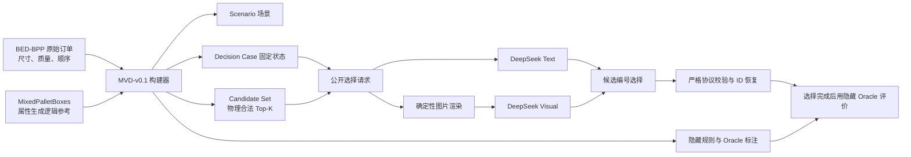

# 阶段 1C 代码框架、数据链路与实验进展全解析

> 文档基于当前仓库源码、`semantic_pallet_dataset_v1`、阶段 1A/1B/1C 方案，以及本地最新正式产物 `semantic_pallet_planner/outputs/EXP_1C_DEEPSEEK_FLASH_FINAL_V1` 编写。统计截止 2026-09-23。本文描述的是当前可复现实现，不把计划中的完整 GOPT、真实工业语义标签或后续在线 VLM 规划写成已经完成的功能。

## 1. 当前项目到底在解决什么问题

当前系统把一次码垛动作拆成两个职责清晰的部分：

1. **几何模块负责“能放在哪里”**：根据托盘、已放箱体和当前待放箱体枚举姿态，过滤所有物理非法位置，再输出最多 16 个合法候选。
2. **语义选择器负责“合法位置中更应该选哪一个”**：DeepSeek 读取自然语言业务指令、当前状态、物料属性和候选信息，从 `C01`～`C16` 中选择一个编号。模型不生成坐标，也不能修改候选。

这种设计把物理安全边界留在确定性程序里，把语言理解与业务偏好留给 VLM。即使模型响应无效，配置中的 `geometry_greedy` 回退也只能选择已通过物理检查的候选。



当前阶段的核心研究问题不是让模型完成连续码垛，而是在**同一组冻结候选上**比较文本 VLM、视觉 VLM、几何基线和特权上界的单步选择效果。连续在线 VLM episode 属于后续阶段。

## 2. 当前进展

### 2.1 已完成的阶段

| 阶段 | 状态 | 主要结果 |
|---|---|---|
| 阶段 0：数据与接口 | 已完成 | MVD-v0.1、Schema、固定候选、隐藏标注、数据校验与来源清单已建立 |
| 阶段 1A：框架与基线 | PASS | 固定案例运行器、在线 episode、随机/几何/手工/Oracle 基线、日志与回放链路完成 |
| 阶段 1B：几何候选 | PASS | EMS-style 极值点候选、物理约束、几何评分、多样性 Top-K、可视化与敏感性分析完成；冻结 `Top-K=16` |
| 阶段 1C：VLM 选择 | 自动验收 PASS | DeepSeek Flash Text/Visual、候选匿名映射、图片输入、严格响应协议、泄漏扫描、缓存、回退、成本与配对统计完成 |

阶段 1A/1B 的正式结论见[阶段1A-1B开发说明](阶段1A-1B开发说明.md)。阶段 1C 的实验设计见[阶段1C实验方案](阶段1C实验方案.md)。

### 2.2 最新正式阶段 1C 产物

最新正式产物目录为：

```text
semantic_pallet_planner/outputs/EXP_1C_DEEPSEEK_FLASH_FINAL_V1/
```

自动验收结果为 **PASS**：

- 360 个固定 Decision Case；
- 每题运行 6 种方法，共 2160 行决策记录；
- Text 有效响应 `360/360`，其中 1 次经过格式修复；
- Visual 有效响应 `357/360`，3 次供应商返回结构异常并按冻结策略回退；
- 720 份模型输入泄漏报告全部通过，命中数为 0；
- 物理硬约束违规为 0；
- 独立回放为 PASS；
- 项目测试和阶段 0 测试均通过。

自动 PASS 表示实验矩阵、协议、物理约束、泄漏控制和证据链达到工程门槛。它不表示 VLM 每次都符合业务语义，也不表示 Visual 一定显著优于 Text。

正式矩阵中的平均语义效用如下：

| 方法 | 平均 soft utility | Oracle 精确命中 | 语义硬规则违规总数 | 输入权限 |
|---|---:|---:|---:|---|
| Random Valid | 0.670115 | 32/360 | 50 | 公开输入 |
| Geometry Greedy | 0.637921 | 108/360 | 60 | 公开输入 |
| Handcrafted Rule | 0.765367 | 360/360 | 39 | 隐藏规则，特权基线 |
| DeepSeek Text | 0.695990 | 58/360 | 45 | 公开文本 |
| DeepSeek Visual | 0.698657 | 58/360 | 45 | 公开文本与两张图 |
| Candidate Oracle | 0.765367 | 360/360 | 39 | 隐藏答案，上界 |

Handcrafted Rule 与 Candidate Oracle 在当前单规则固定题上结果相同。Oracle 的语义硬规则违规不一定为 0，因为 Oracle 只能在**冻结候选集内部**选最优；如果所有候选都违反硬规则，它只能选择违规较少者。

配对结果更适合回答“同一道题上有没有改善”：

| 对比 | 平均效用差 | 胜/平/负 |
|---|---:|---:|
| Text − Geometry | +0.058069 | 119 / 181 / 60 |
| Visual − Geometry | +0.060736 | 130 / 169 / 61 |
| Visual − Text | +0.002667 | 30 / 317 / 13 |

因此当前证据支持“VLM 总体优于纯几何语义效用”，但视觉相对文本的平均增益很小，而且 317/360 同分。是否有稳定视觉贡献仍需结合重复调用、置信区间和错误类型讨论。

## 3. 仓库代码框架

项目分成数据集、规划器和文档三个主要部分。

```text
NBU_Papper/
├── raw/                               外部原始数据，通常不提交 Git
├── semantic_pallet_dataset_v1/        可复现的 MVD-v0.1 数据集
│   ├── scripts/build_dataset.py       数据构建主程序
│   ├── configs/mvd_v0.1.json          数据和几何生成冻结参数
│   ├── tasks/                         场景和固定决策题
│   ├── candidates/                    候选集和候选生成审计
│   ├── annotations/                   隐藏规则、Oracle 和参考方案
│   ├── splits/                        数据划分与配对关系
│   ├── streams/                       后续 ReMe 连续流任务
│   ├── catalog/、statistics/          物料目录和统计审计
│   └── provenance/                    数据来源和哈希
├── semantic_pallet_planner/
│   ├── configs/                       1A/1B/1C 运行配置
│   ├── src/semantic_pallet_planner/
│   │   ├── planner/                   候选枚举、约束和评分
│   │   ├── selectors/                 基线与 VLM 选择器
│   │   ├── vlm/                       DeepSeek/GLM、提示词、映射、解析、缓存
│   │   ├── runners/                   固定案例、在线回合与验收矩阵
│   │   ├── evaluation/                语义评分、指标、回放与报告
│   │   ├── visualization/             工作区、候选拼图和 episode 动画
│   │   ├── repository.py              只读数据访问与交叉校验
│   │   ├── protocol.py                公共请求/响应协议
│   │   └── cli.py                     命令行入口
│   ├── tests/                         单元、集成、golden 测试
│   └── outputs/                       每次实验的完整证据
└── docs/                              方案、开发说明和产物分析
```

其中最关键的权限边界是：`Repository.get_oracle()` 和 `get_rules()` 只供评价器或明确标记为 `privileged_input=True` 的基线使用；普通 VLM 选择器只接收 `protocol.build_request()` 生成的公开请求。

## 4. 数据集从哪里来

### 4.1 两个来源承担不同职责

MVD-v0.1 不是把两个外部仓库直接拼接后得到的数据集。

**BED-BPP 提供真实订单层面的基础字段：**

- 箱体 `length/mm`、`width/mm`、`height/mm`；
- `weight/kg`；
- article ID；
- 所属订单；
- 订单内 `sequence` 到货顺序；
- 原始 `product_group` 被保存在内部来源字段中，但当前公开的 `product_category` 并非直接由它映射。

仓库中的原始 BED-BPP JSON 大约 78.3 MB，包含 10003 个订单。构建程序读取每个订单的 `item_sequence`，按数值 `sequence` 排序，然后规范化为统一箱体记录。

**MixedPalletBoxes 提供语义属性构造方式的参考：**

当前数据集没有逐条复制 MixedPalletBoxes 样本。构建器参考其 `box_generator.py` 的物料属性生成思路，在本地用固定种子和 article ID 确定性合成材质、易碎性、可堆叠性与顶部承重能力。来源修订和哈希保存在 `semantic_pallet_dataset_v1/provenance/manifest.json`。

来源清单冻结了：

- BED-BPP 文件 SHA-256；
- MixedPalletBoxes Git revision；
- MixedPalletBoxes `box_generator.py` SHA-256；
- 本地构建配置和构建脚本路径。

这使任何数据变动都可以被追溯。

### 4.2 每个物料字段究竟从哪里来

| 公开字段 | 来源/计算方法 | 性质 |
|---|---|---|
| `dimensions_mm` | BED-BPP 长、宽、高 | 原始物理数据 |
| `mass_kg` | BED-BPP `weight/kg` | 原始物理数据 |
| 到货顺序 | BED-BPP `sequence` 排序 | 原始订单数据 |
| `geometry_id` | 水平长宽排序后拼接高度 | 本地确定性派生 |
| `weight_class` | 训练集质量的三分位阈值 | 本地派生；light ≤ 5.5 kg，medium ≤ 7.75 kg，其余 heavy |
| `material` | 固定种子＋article ID 按材质权重抽取 | 合成语义属性 |
| `fragile` | 固定种子＋article ID＋材质条件概率 | 合成语义属性 |
| `stackable` | 固定种子＋article ID＋材质条件概率 | 合成语义属性 |
| `top_load_limit_kg_synthetic` | 体积 × 合成厚度 × 材质系数，最大 500 kg | 合成物理代理，不是真实抗压测量 |
| `product_category` | 固定种子＋article ID，以 25% 概率标为 electronics，否则 general | 合成语义属性 |

`stable_unit(seed, article_id, attribute_name)` 使用 SHA-256 产生 `[0,1)` 的稳定数，因此同一配置和来源始终得到相同属性，不受 Python 进程随机状态影响。同一 article ID 在不同场景中也保持一致属性。

需要特别注意：当前 `product_category=electronics/general` 是合成标签，并不是 BED-BPP 原始 `product_group` 的真实语义映射。阶段 1C 验证的是系统链路和合成规则上的选择能力，尚不能直接推断真实仓储业务效果。

## 5. 数据集如何提取和构建

数据构建入口是 `semantic_pallet_dataset_v1/scripts/build_dataset.py`，冻结配置是 `semantic_pallet_dataset_v1/configs/mvd_v0.1.json`。

### 5.1 订单规范化

构建程序首先：

1. 读取 BED-BPP JSON；
2. 对订单 key 排序后，用 `dataset_seed=20260911` 确定性打乱订单次序；
3. 按每个订单的 `sequence` 排列箱体；
4. 转换尺寸、质量、来源 ID；
5. 生成 `geometry_id`、常规/高箱几何簇和合成语义属性。

每个来源订单最多只被一个基础 Scenario 使用，避免同一订单跨划分重复。

### 5.2 从订单中选择连续窗口

每个 Scenario 不是任意抽箱，而是从一个订单的合格物料序列中选取 8～20 个箱体的连续窗口。窗口必须满足：

- 每个箱体至少能以 0° 或 90° 放入 `1200 × 1000 × 850 mm` 容器；
- 总箱体体积占容器体积 35%～80%；
- 至少 3 种 `geometry_id`；
- 至少 3 种箱体高度；
- 该窗口能通过参考几何 rollout 形成多层方案，只有地面单层的窗口不保留。

不同划分还有额外条件：

- `train`、`validation`、`test_id`：只用常规高度箱，并排除 `fragile=true + electronics` 的组合；
- `test_geometry_ood`：至少包含 3 个高度不小于 340 mm 的高箱，同时排除语义 OOD 组合；
- `test_semantic_ood`：保持常规几何，但至少包含 2 个“易碎电子产品”组合。

所有合格窗口由稳定随机数选择，因此重新构建结果可复现。

### 5.3 场景、固定决策题和语言变体

数据集包含：

| 内容 | 数量 | 说明 |
|---|---:|---|
| 基础 Scenario | 100 | train 50、validation 10、test-ID 20、Geometry-OOD 10、Semantic-OOD 10 |
| 可见 Scenario 文件 | 140 | 100 基础场景＋20 Language-OOD＋20 buffer_size=3 配对场景 |
| 固定 Decision Case | 360 | 100 基础场景每场 3 题得到 300 题；20 个 Test-ID 场景的语言变体再复制 60 题 |
| 物料实例 | 1513 | 基础场景中的全部箱体实例 |
| 唯一几何 | 232 | 按规范化长宽高统计 |
| 唯一 article | 405 | 按来源 article ID 统计 |

每个基础场景会执行一次几何参考 rollout。每个步骤都保存当时的已放箱体、当前箱体和 Top-K 候选。随后计算该步骤在当前业务规则下的候选效用范围，优先抽取语义差异明显且与几何最优冲突的步骤，每场固定 3 道 Decision Case。

`test_language_ood` 与 `test_id` 共享完全相同的物理状态与候选坐标，只替换为第二种自然语言改写，并使用新的不透明 Scenario、Decision Case 和 Candidate Set ID。因此二者是配对视图，统计时不能当成完全独立的物理样本。

20 个 `buffer_size=3` 场景只有场景定义，没有冻结候选。因为多缓冲区动作还要同时决定“选哪个箱体”，需要后续规划器在线生成，当前阶段 1C 固定矩阵仍使用 `buffer_size=1`。

### 5.4 数据集目录的可见与隐藏层

| 目录 | 主要内容 | VLM 是否可见 |
|---|---|---|
| `tasks/scenarios/` | 容器、物料、到货顺序、自然语言指令 | 运行器按需读取 |
| `tasks/decision_cases/` | 某一步的已放物料、当前物料、指令、候选集 ID | 是 |
| `candidates/candidate_sets/` | 冻结的物理合法 Top-K | 经过公共协议筛选后可见 |
| `candidates/candidate_audits/` | 拒绝统计、Pareto 和几何最优审计 | 否 |
| `annotations/ground_truth_rules/` | 结构化规则、来源订单与配对信息 | 否 |
| `annotations/oracle_candidate_scores/` | 每候选语义分、违规和 Oracle 答案 | 否 |
| `annotations/reference_feasible_plans/` | 参考可行布局 | 否 |
| `splits/`、`catalog/`、`statistics/`、`provenance/` | 划分、数据审计和来源 | 否 |

这种物理隔离非常重要。自然语言指令可以给模型，但 `ground_truth_rule.rule_type`、Oracle ID 和每候选真实语义分只能在模型选择之后用于评价。

## 6. 业务语义规则从哪里来

当前共有五类冻结规则，每个 Scenario 只绑定一条：

| 规则 | 自然语言含义 | 类型 | 隐藏评分逻辑 |
|---|---|---|---|
| `heavy_low` | 重物尽量放低 | soft | 对所有 heavy 箱的归一化底面高度取平均，越低越好 |
| `heavy_center` | 重物靠近托盘底面中心 | soft | 对所有 heavy 箱自身中心到托盘 XY 中心的距离评分，越近越好 |
| `fragile_protect` | 易碎箱少承载并优先放高 | soft | 每个易碎箱 `0.6 × 未使用承载比例 + 0.4 × 归一化高度` |
| `category_group` | 电子产品集中码放 | soft | 所有电子箱中心的两两三维平均距离越小越好 |
| `category_separate` | 电子产品不得与重物直接接触或形成支撑 | hard | 检查电子箱与 heavy 箱的面接触，按违规对数扣分并记录违规 |

规则定义在数据构建脚本和运行时 `evaluation/semantic.py` 中冻结。构建器按数据划分平衡五类规则的数量，同时优先把某个场景分配给能产生明显候选差异的规则。所谓“明显”是：候选语义效用范围至少 0.05，且语义 Oracle 与 Geometry-Greedy 不同。

### 6.1 VLM 得到哪些语义信息

VLM 的语义判断依据来自两部分：

1. **自然语言指令**，例如“易碎箱应尽量不承载其他箱体，并优先放在较高层”；
2. **公开物料属性**，包括当前和已放箱体的 `weight_class`、`material`、`fragile`、`stackable`、`top_load_limit_kg_synthetic`、`product_category`。

候选还给出位置、支撑箱 ID、支撑率、承载余量、总体高度、体积利用率、整体质心偏移和四个几何分量。VLM 需要自行把指令、物料属性和候选关系组合起来。

VLM 不会收到：

- `rule_type` 和 hard/soft 真值；
- `candidate_evaluations`；
- `oracle_candidate_id`；
- `semantic_decision_required`；
- 数据划分名；
- 来源订单和 article ID；
- 未来物料；
- 真实内部 `candidate_id`。

## 7. 几何模块如何生成可行空间

当前实现是 **EMS-style 极值点候选器**，不是完整 GOPT。这里的“可行空间”也不是把所有空余体积精确切成最大空矩形集合，而是由托盘边界、已放箱体边界和箱顶支撑层产生一组有限的候选锚点。

数据构建版逻辑在 `scripts/build_dataset.py`，运行时等价实现拆分在：

- `planner/generator.py`：枚举、去重、过滤、Top-K 和计时；
- `planner/constraints.py`：姿态物理检查及候选特征计算；
- `planner/scoring.py`：冻结几何权重和 Pareto 判断。

### 7.1 坐标和姿态

托盘底面中心为 `(0,0,0)`：

- X 范围为 `[-600, 600] mm`；
- Y 范围为 `[-500, 500] mm`；
- Z 向上，最大 850 mm；
- 候选 `pose.x_mm/y_mm` 表示箱体中心；
- `z_base_mm` 表示箱底高度；
- 当前只枚举 `yaw=0°` 和 `yaw=90°`。

### 7.2 极值点枚举

对每个朝向得到箱体水平尺寸 `(L,W)` 后：

1. 枚举高度集合 `Z={0} ∪ {所有已放箱体顶面 z1}`；
2. 在地面 `z=0`，X 候选来自托盘左右边界、已放箱体右侧 `p.x1`、已放箱体左侧减去新箱长 `p.x0-L`；Y 同理；
3. 在支撑层 `z>0`，只使用顶面恰好等于该高度的支撑箱，并同时考虑支撑箱左右边界与箱体尺寸偏移；
4. 对每层的 X、Y 做笛卡尔积；
5. 用 `(x0,y0,z0,yaw)` 去重。

简化伪代码为：

```text
for yaw in [0, 90]:
    L, W = oriented_size(item, yaw)
    for z in {0} union placed_top_heights:
        xs = pallet_x_boundaries + placed/support_x_edges adjusted by L
        ys = pallet_y_boundaries + placed/support_y_edges adjusted by W
        for x0 in xs:
            for y0 in ys:
                evaluate_pose(x0, y0, z, yaw)
```

这种边缘对齐能够覆盖许多紧凑布局，同时把连续坐标搜索转成有限枚举。

### 7.3 物理合法性过滤

每个枚举姿态依次检查：

1. **边界**：箱体六个边界不能超出托盘水平范围和最大高度；
2. **总载荷**：已放质量加当前质量不得超过 1000 kg；
3. **三维碰撞**：X、Y、Z 三轴都有正重叠才算实体重叠；仅面接触允许；
4. **支撑率**：若 `z>0`，计算所有同高支撑箱与新箱底面的交矩形并求并集面积，要求

   `support_ratio = union_support_area / box_bottom_area ≥ 0.70`；

5. **质心投影**：当前实现要求新箱底面中心落在至少一个单独的支撑交矩形内；
6. **支撑箱可堆叠**：所有发生底面交叠的支撑箱都必须 `stackable=true`；
7. **承载能力**：按交叠面积比例把当前箱质量分配给直接支撑箱，并沿已有支撑图递归向下传播；任何箱体累计承载超过 `top_load_limit_kg_synthetic` 就拒绝。

拒绝原因会计入 `rejection_histogram`。整个数据集构建时记录到的主要拒绝包括越界 83383 次、碰撞 47617 次、支撑不足 20453 次、不可堆叠支撑 883 次、过载 133 次和质心不在支撑面 24 次。这些是枚举尝试数，不是独立箱体数。

### 7.4 合法候选的几何评分

通过过滤后，程序把当前候选加入状态并计算四项 `[0,1]` 分数：

1. `compactness`：全部已放箱体体积之和除以当前布局轴对齐包围盒体积；
2. `height`：`1 - 当前最高点 / 最大允许高度`；
3. `stability`：当前箱体支撑率，地面候选为 1；
4. `balance`：`1 - 全部已放质量的 XY 质心偏移 / 托盘半对角线`。

冻结总分为：

```text
geometry_score =
    0.35 × compactness
  + 0.25 × height
  + 0.25 × stability
  + 0.15 × balance
```

要避免一个常见误读：`resulting_geometry.center_of_mass_offset_mm` 是**整个已放布局的质量质心偏移**。`heavy_center` 的语义规则评价的是 heavy 箱自身的 XY 位置。两者相关但不相同，VLM 在人工审查中多次把它们混为一谈。

### 7.5 多样性 Top-K

所有合法候选先按几何总分降序排列。`diverse_v1` 为每个候选建立分层标签：

- 地面 / 上层；
- 托盘中心区域 / 边缘区域；
- 支撑箱数量 0、1、2+；
- 当前物料 ID；
- 运行时实现还把 yaw 和是否属于 Pareto 前沿纳入分层。

程序先取每个分层中得分最高的候选，再按全局分数补齐到 K。数据集冻结候选的脚本版本与当前在线实现保持核心逻辑一致，但在线 `diverse_v1` 的分层更细，因此已有固定 Candidate Set 是不可覆盖的实验资产，正式固定题不会临时重生成替换。

同时计算四分量的 Pareto 前沿，并审计：

- Pareto 候选被 Top-K 覆盖的比例；
- 全体合法候选中的几何最优指纹与分数；
- Top-K 是否至少包含一个距几何最优不超过 `epsilon=0.05` 的候选；
- 原始枚举数、合法数和拒绝原因。

## 8. 固定 Decision Case 如何形成

每个基础场景先由几何分最高候选逐步 rollout，得到一条**参考可行轨迹**。这条轨迹不是全局最优 GOPT 解，也不代表模型最后应沿它执行。

对轨迹中的每一步，构建器保存：

- 放置前状态；
- 当前待放物料；
- 所有返回的 Top-K 候选；
- 候选生成审计；
- 将每个候选临时加入状态后的隐藏语义评分。

然后按“语义规则是否能区分候选、语义最优是否与几何最优冲突、语义分差多大”排序，每个场景选择 3 个步骤作为固定 Decision Case。最后再确定性打乱候选文件中的呈现顺序，防止“第一个候选总是最好”。

固定题的三个核心文件通过 ID 和哈希关联：

```text
tasks/decision_cases/DC_00151.json
      │ candidate_set_id
      ▼
candidates/candidate_sets/CSET_00151.json
      │ 同一 physical_state_hash
      ▼
annotations/oracle_candidate_scores/DC_00151.json   ← 仅评价阶段读取
```

`physical_state_hash` 对容器、已放物料、当前可用物料和 buffer size 做规范 JSON 的 SHA-256。读取数据时若 Scenario、Decision Case、Candidate Set 的步号、ID 或哈希不一致，`DatasetRepository` 会立即报错。

## 9. 输入给 DeepSeek 的具体内容

### 9.1 公共结构化请求

`protocol.build_request()` 生成 `pallet_vlm_request_v1`，包括：

- `request_id`；
- `state_hash`；
- `instruction_text`；
- 托盘尺寸和最大载荷；
- `placed_items`：每个已放箱体的尺寸、质量、语义属性、姿态、累计承载和支撑比例；
- `available_items`：当前待放箱体及其公开属性；
- `candidates`：每个候选的位置、朝向、支撑关系、承载余量、结果几何量和四项几何分；
- `visual_inputs`：文本模式为空占位，视觉模式在渲染后指向两张图片。

### 9.2 候选匿名映射

VLM 不直接看到内部 `cand_xxx`。`candidate_mapping.py` 使用：

```text
seed + request_id + mapping_version
```

生成稳定随机顺序，然后将候选改名为 `C01`～`CK`。内部映射单独写入 `mapping.audit.json`，不进入模型提示词。Text 与 Visual 对同一题使用同一映射，所以二者比较公平。

匿名化有三个作用：

1. 防止候选 ID 中的构建顺序形成暗示；
2. 让文本列表与候选拼图编号一致；
3. 保证模型只能做离散选择，不能伪造内部 ID。

### 9.3 系统提示词和用户提示词

系统提示词要求模型：

- 所有候选已经过物理检查；
- 先满足自然语言业务硬规则，再比较软偏好；
- 语义接近时保留较好几何质量；
- 只能选择给定 C 编号；
- 不能生成坐标、修改候选或推测未来物料；
- 只输出一个严格 JSON 对象。

用户提示词包含完整 `DECISION_REQUEST` JSON，并要求原样复制 `request_id` 和 `state_hash`。输出协议只允许：

```json
{
  "schema_version": "pallet_vlm_choice_v1",
  "request_id": "DC_xxxxx",
  "state_hash": "64位哈希",
  "display_candidate_id": "Cxx",
  "confidence": 0.8,
  "applied_rule": "简短规则名",
  "reason": "简短中文理由"
}
```

### 9.4 Visual 模式的两张图片

Visual 模式并不是“取料区原始相机照片＋真实放料区照片”。当前图片由结构化状态**确定性渲染**：

1. `workspace.png`：当前取料箱、已放托盘布局、物料属性和自然语言指令；
2. `candidates_montage.png`：每个 C 编号对应一幅 3D 缩略图，显示放置前状态并高亮该候选，同时标注高度、yaw 和支撑率。

`DeepSeekClient` 把系统提示词作为 system message，把用户文本作为 user content 的 text 块，再把两张 PNG Base64 编码为两个 `image_url` 块，`detail="original"`，请求 `deepseek-flash`。因此从代码和保存证据可以确认图片进入了 API 请求构造链路；实验无法证明模型内部实际用了多少视觉信息。

## 10. DeepSeek 如何完成语义决策

DeepSeek 的任务本质是对候选做关系推理：

1. 从指令理解目标属性和偏好；
2. 在当前物料和已放物料中找到目标对象；
3. 结合候选 `pose`、`support_item_ids`、支撑率、承载余量和结果几何量判断每个候选的影响；
4. 若指令是硬规则，先排除会产生业务接触的候选；
5. 在剩余候选中平衡语义偏好与几何质量；
6. 返回一个 C 编号和简短理由。

程序不会把模型理由转换成分数。真正提交的动作只由 `display_candidate_id` 决定。`confidence`、`applied_rule` 和 `reason` 用于审计模型是否理解题目，但不会改变选择。

响应处理按以下顺序执行：

1. 解析 JSON，可兼容一个完整外层 Markdown JSON 围栏；
2. 用 JSON Schema 检查字段、类型和额外字段；
3. 检查 `request_id`；
4. 检查 `state_hash`；
5. 检查 C 编号属于本题；
6. 通过本地映射恢复内部候选 ID；
7. 再由公共协议确认内部 ID 属于当前候选集。

若首次输出只是 `invalid_json` 或 `schema_error`，最多发起 1 次修复请求。ID 或状态哈希错误不会被静默接受。最终仍失败时，固定配置回退到 Geometry-Greedy，并在逐题指标中记录 `fallback=True`、错误类别和原始异常。

## 11. 泄漏防护、缓存和可复现性

### 11.1 模型输入泄漏检查

发送前会扫描完整公开请求和用户文本，禁止出现：

- `oracle_candidate_id`；
- `candidate_evaluations`；
- `ground_truth_rule`；
- `semantic_decision_required`；
- `split`；
- `source_order_id`；
- 任意真实内部 candidate ID。

发现命中时不调用模型，直接报错。正式实验 720 个 Text/Visual 输入全部通过，命中为 0。

### 11.2 响应缓存

缓存键由 provider、模型请求和 prompt version 的内容哈希组成。相同提示词、图片内容和参数可以重用已有响应，避免重复付费。正式 `FINAL_V1` 的 `cache_hit_count=0`，说明这 720 个结果是该实验目录中的实际新调用，并非从本地缓存复用。

### 11.3 实验清单

`manifest.json` 保存：

- 配置哈希；
- 所有相关源码和测试文件哈希；
- 数据集文件哈希；
- 核心结果哈希；
- 实验 ID 和运行环境信息。

`replay_report.json` 使用保存的事件重新检查候选和结果。它证明保存的证据内部一致，不能让不可确定的远程模型再次输出同样文本。

## 12. 六种方法如何公平比较

固定矩阵的六种方法都面对同一个 Candidate Set：

| 方法 | 选择逻辑 |
|---|---|
| `random_valid` | 在合法候选中按固定随机种子选择 |
| `geometry_greedy` | 选择冻结几何总分最高者 |
| `handcrafted_rule` | 读取隐藏结构化规则，先最少语义硬违规，再最大语义分，最后最大几何分 |
| `vlm_text` | 只用公开结构化文本请求选择 C 编号 |
| `vlm_visual` | 公开结构化文本＋两张渲染图选择同一组 C 编号 |
| `candidate_oracle` | 直接读取冻结候选集内部的隐藏最佳候选 |

`handcrafted_rule` 和 `candidate_oracle` 是特权对照，不应被描述为和 VLM 信息条件相同。它们用于判断候选空间的语义上界，以及模型错误来自候选生成还是候选选择。

## 13. 语义评价和主要指标

模型完成选择后，`FixedCaseRunner` 才调用 `Repository.get_oracle()`。评价器把所选候选临时加入状态，读取冻结标注并产生：

- `soft_utility`：当前业务规则的 `[0,1]` 效用；
- `semantic_hard_violations`：业务硬规则违规数；
- `oracle_hit`：是否命中唯一冻结 Oracle ID；
- `oracle_regret`：Oracle soft utility 减去所选 soft utility；
- `oracle_hard_violation_regret`：所选与 Oracle 的硬规则违规差；
- `semantic_decision_required`：本题是否满足效用范围 ≥ 0.05 且语义最优与几何最优冲突；
- `geometry_score`、高度、体积率、质心偏移和支撑率；
- 协议有效性、回退、修复、token、API 时延、缓存和提示词/映射哈希。

两个“硬违规”字段不能混用：

- `hard_violations` 是几何/物理硬约束违规；正式实验为 0；
- `semantic_hard_violations` 是业务语义规则违规；VLM 正式矩阵各有 45 次。

`oracle_hit=False` 也不一定代表效用变差。如果多个候选语义同分，数据集只按语义硬违规、soft utility、几何分的次序选一个 Oracle ID；另一个同分候选可能 `oracle_regret=0`。因此要同时看命中率和 regret。

## 14. 如何阅读最新正式产物

建议按以下顺序查看 `EXP_1C_DEEPSEEK_FLASH_FINAL_V1`：

1. **`acceptance_report.md/json`**：先确认所有工程门槛是否通过；
2. **`config.snapshot.json`**：确认 provider、model、Top-K、温度、超时、修复次数和 fallback；
3. **`manifest.json`**：确认本次运行对应的代码、数据和配置哈希；
4. **`metrics/protocol_summary.json`**：看 Text/Visual 有效率、修复和回退；
5. **`metrics/paired_comparisons.json`**：看同题 Text/Visual 相对 Geometry 的胜平负和平均差；
6. **`metrics/per_decision.csv`**：定位具体案例，按 `decision_case_id` 横向比较六种方法；
7. **`selector_inputs/vlm_text/DC_xxxxx/` 与 `vlm_visual/DC_xxxxx/`**：还原模型实际看到什么、回答什么；
8. **数据集对应的 Oracle JSON**：只在事后审查时核对候选分数和隐藏规则；
9. **`leakage_report.json`、`replay_report.json`、`tests/status.json`**：确认泄漏、证据一致性和测试；
10. **`metrics/cost_summary.json`**：读 token 和时延。当前价格配置为 `null`，所以 `estimated_cost_total=0` 表示未配置单价，不表示 API 免费。

每个 VLM 案例目录包含：

```text
public_request.json       模型可见的结构化题目
mapping.audit.json        本地 C 编号到内部候选 ID；模型不可见
prompt.json               实际系统提示词、用户文本和图片路径
leakage_report.json       发送前扫描
response.json             原始响应、解析结果和内部 core_response
workspace.png             仅 Visual 模式
candidates_montage.png    仅 Visual 模式
```

还原一题时应先看 `response.json.parsed.display_candidate_id`，再在 `mapping.audit.json` 找到内部 ID，然后在 `per_decision.csv` 查看该方法的 utility/regret，最后在 Oracle JSON 对比所有候选。不要把 `reason` 中的自述直接当成正确解释。

## 15. 最新实验暴露出的具体问题

20 个 validation 案例的独立审查发现，Text 与 Visual 在这 20 题上都选择相同候选；14 题有正 regret，6 题与最佳语义效用同分。详细证据见[阶段1C验证集20案例独立审查记录](阶段1C验证集20案例独立审查记录.md)。主要问题是：

1. **把整体质心当成当前重箱位置**：`heavy_center` 需要比较 heavy 箱自身 XY 距离，模型常引用候选的整体 `center_of_mass_offset_mm`；
2. **反向理解支撑关系**：`support_item_ids=[item_06]` 表示当前箱压在 `item_06` 上，会给它增加载荷；模型曾解释成“不增加其承载”；
3. **电子产品聚类判断过于局部**：`category_group` 需要比较所有电子箱的两两距离，模型常凭“附近有一个箱”作判断；
4. **误认物料属性**：理由中出现把 general 说成 electronics、把非易碎支撑箱说成易碎箱；
5. **混淆软偏好和硬规则**：部分理由把 `heavy_low` 等 soft 规则称为硬规则；
6. **业务硬规则仍会失败**：`DC_00177` 把电子箱放在 heavy 箱上，产生 `electronics_heavy_contact:1`。

正式实验还有 4 个协议/供应商异常值得关注：

- `DC_00274` Text：首次 state hash 错误，第二次响应修复成功，没有回退；
- `DC_00324`、`DC_00335`、`DC_00338` Visual：供应商返回结构无法解析，三题回退 Geometry-Greedy；其中一题回退命中 Oracle，两题存在语义损失。

保存的错误证据只能证明 DeepSeek 适配器收到的响应结构不符合预期，不能进一步断定是图片解码、网络、配额还是供应商内部格式问题，因为失败响应没有保留完整供应商原始体。

## 16. token、时延与费用如何解释

正式 `FINAL_V1`：

| 模式 | 输入 token | 输出 token | 成功请求平均 API 时延 | 本地缓存命中 |
|---|---:|---:|---:|---:|
| Text | 1,474,172 | 46,528 | 1.327 s | 0 |
| Visual | 2,035,645 | 46,882 | 2.090 s | 0 |

Visual 输入 token 比 Text 多约 38%，平均 API 时延也更高。此前 validation 的 DeepSeek 控制台记录为 60 次请求、324741 token、实际支出 0.21 元；这类供应商账单应作为真实费用证据。当前 YAML 中 `input_cost_per_million` 和 `output_cost_per_million` 都是 `null`，程序无法据此计算费用，所以产物内的 0 不能作为成本结论。

## 17. 当前实现的边界

理解当前结果时要保留以下边界：

- MVD-v0.1 是最小功能数据集，用于接口、消融和工程验证，不承担最终工业统计结论；
- 语义属性和顶部承重是确定性合成值；
- 几何候选器是 EMS-style 极值点方法，不是完整 GOPT，也没有证明全局最优；
- 当前候选只支持水平 0°/90° 姿态；
- 支撑质心检查使用“中心落在至少一个支撑交矩形”，没有计算任意多矩形支撑并集的完整稳定多边形；
- 阶段 1C 正式矩阵是固定单步题，不是在 VLM 自己造成的新状态上连续规划；
- 当前视觉输入是结构化状态渲染图，不是真实相机 RGB-D 图像；
- 单次远程调用不能证明模型稳定性，关键论文结论仍应进行多随机种子或重复调用；
- Assistant 完成的 20 案例独立审查不是研究者本人签署，若验收流程要求人工签名，仍需研究者复核审计表。

## 18. 后续开发应优先做什么

### 18.1 在不触碰正式 test 结论的前提下改进提示词

只在 train/validation 上开发新 prompt version，明确加入以下关系定义：

- `support_item_ids` 是被当前候选压住的箱体；
- `heavy_center` 比较当前 heavy 箱自身 XY，而非整体质心；
- `category_group` 要比较全部电子箱；
- hard/soft 由自然语言约束强度判断，理由不得擅自改写规则等级。

修改后产生新的实验 ID 和 prompt version，不能覆盖 `FINAL_V1`。

### 18.2 增加结构化语义辅助特征

几何模块可以在不泄漏 Oracle 的条件下计算公开的候选关系特征，例如：

- 当前箱自身到托盘中心的距离；
- 当前箱底面高度；
- 当前箱是否压在 fragile/heavy/electronics 箱上；
- 当前候选到已有同类物料的最小/平均距离；
- 放置后各目标物料的新增承载量。

这些是由公开状态确定性计算的事实，不是隐藏答案。它们可以减少 VLM 从长 JSON 中手工推导关系的错误，同时必须在新版本中重新做泄漏审计和公平比较。

### 18.3 单列业务硬规则指标

后续报告应对 `category_separate` 单列：

- hard-rule violation rate；
- 与 Oracle 的违规数差；
- fallback 后的语义硬规则后果；
- “候选集中存在零违规解”的条件命中率。

这样不会再用“物理 hard violations=0”掩盖业务规则风险。

### 18.4 完成重复调用和在线闭环

固定题重复调用用于测量远程模型波动、视觉增益和位置偏差。确认选择器版本后，再进入在线 VLM episode：每一步根据 VLM 上一步真实选择形成的新状态重新生成候选，不能沿用参考轨迹后续的冻结 Candidate Set。

### 18.5 扩展真实数据与真实视觉

进入工业验证前需要把合成 `product_category`、`fragile`、`stackable` 和承重替换或校准为真实 WMS/物料主数据，并将当前渲染图基线扩展到真实取料区、托盘区 RGB-D 或点云输入。届时仍应保留当前结构化文本模式作为消融基线。

## 19. 关键代码和证据索引

| 想了解的问题 | 对应文件 |
|---|---|
| 数据怎么构建 | `semantic_pallet_dataset_v1/scripts/build_dataset.py` |
| 数据冻结参数 | `semantic_pallet_dataset_v1/configs/mvd_v0.1.json` |
| 来源哈希 | `semantic_pallet_dataset_v1/provenance/manifest.json` |
| 数据规模和偏差审计 | `semantic_pallet_dataset_v1/statistics/dataset_summary.json` |
| 数据访问和隐藏权限 | `semantic_pallet_planner/src/semantic_pallet_planner/repository.py` |
| 公共请求协议 | `semantic_pallet_planner/src/semantic_pallet_planner/protocol.py` |
| 几何枚举与 Top-K | `semantic_pallet_planner/src/semantic_pallet_planner/planner/generator.py` |
| 物理合法性 | `semantic_pallet_planner/src/semantic_pallet_planner/planner/constraints.py` |
| 几何分数 | `semantic_pallet_planner/src/semantic_pallet_planner/planner/scoring.py` |
| 语义规则真值 | `semantic_pallet_planner/src/semantic_pallet_planner/evaluation/semantic.py` |
| 基线选择器 | `semantic_pallet_planner/src/semantic_pallet_planner/selectors/baselines.py` |
| VLM 选择主链路 | `semantic_pallet_planner/src/semantic_pallet_planner/selectors/vlm.py` |
| 候选匿名映射 | `semantic_pallet_planner/src/semantic_pallet_planner/vlm/candidate_mapping.py` |
| 提示词和输出 Schema | `semantic_pallet_planner/src/semantic_pallet_planner/vlm/prompt_builder.py` |
| DeepSeek 图片和 API 请求 | `semantic_pallet_planner/src/semantic_pallet_planner/vlm/deepseek_client.py` |
| 响应严格解析 | `semantic_pallet_planner/src/semantic_pallet_planner/vlm/response_parser.py` |
| 泄漏扫描 | `semantic_pallet_planner/src/semantic_pallet_planner/vlm/leakage.py` |
| 两张视觉图生成 | `semantic_pallet_planner/src/semantic_pallet_planner/visualization/renderer.py` |
| 固定题执行顺序 | `semantic_pallet_planner/src/semantic_pallet_planner/runners/core.py` |
| 1C 注册与配置 | `semantic_pallet_planner/src/semantic_pallet_planner/runners/stage1c.py` |
| 1C 汇总与验收门槛 | `semantic_pallet_planner/src/semantic_pallet_planner/evaluation/stage1c.py` |
| 正式验收编排 | `semantic_pallet_planner/src/semantic_pallet_planner/runners/acceptance.py` |
| 最新正式验收入口 | `semantic_pallet_planner/outputs/EXP_1C_DEEPSEEK_FLASH_FINAL_V1/acceptance_report.md` |
| 验证集逐案例审查 | `docs/阶段1C验证集20案例独立审查记录.md` |

这套实现目前已经形成一条完整且可审计的链路：**原始订单和确定性合成属性 → 可复现的数据划分 → 物理合法 Top-K → 匿名公开请求与两图视觉输入 → DeepSeek 离散选择 → 严格协议和回退 → 隐藏 Oracle 事后评价 → 全量实验、回放与验收证据**。后续开发的重点已经从“把链路跑通”转向“改善语义关系推理、验证视觉增益、控制业务硬规则风险，并最终进入真实状态上的在线闭环”。
